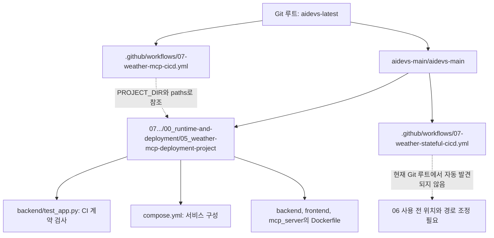
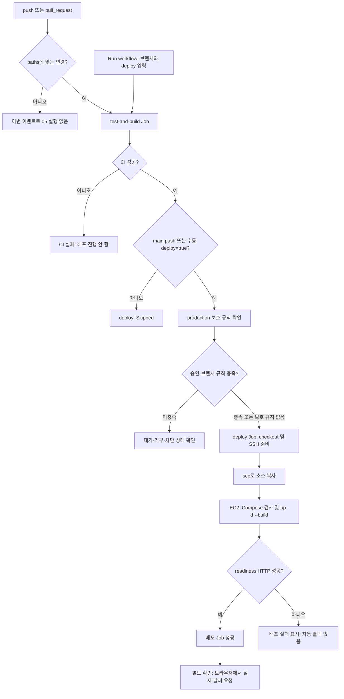
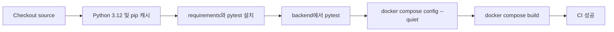
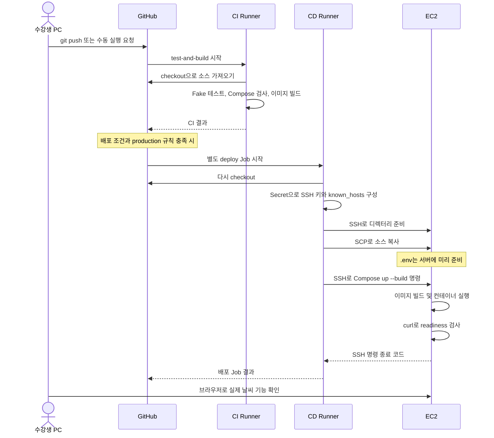
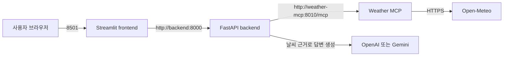
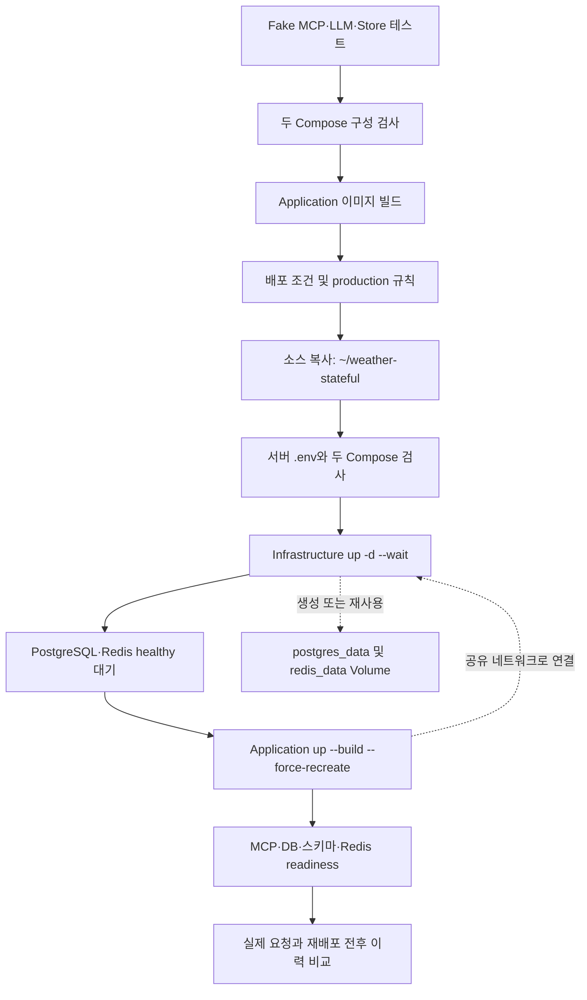
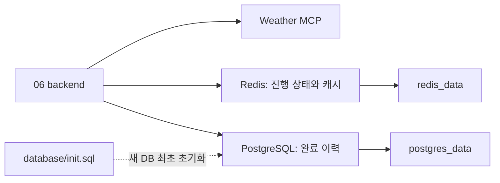
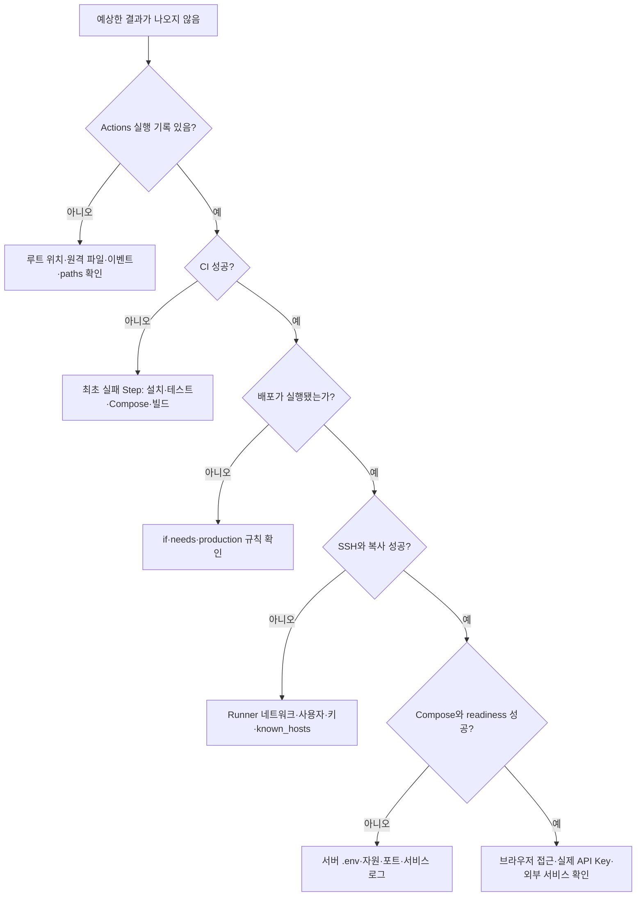

# GitHub Actions 워크플로우 시각화

[01 개념·YAML·실행 강의](01_github-actions-cicd-lecture.md)의 보조 자료다. Mermaid 지원 Markdown 미리보기에서 다이어그램을 볼 수 있다. 각 그림 아래에는 텍스트 설명을 함께 적었다.

기준일: 2026-09-21. **현재 코드에 정의된 흐름**이며 원격 실행 성공을 확인한 그림은 아니다. 05는 실제 Git 루트의 YAML, 06은 중첩 폴더에 있는 예제 YAML을 근거로 한다.

## 1. 파일 지도: 무엇을 열어야 하는가?

실제 Git 루트는 `C:\수업 보관소\aidevs-latest`다. 강의 자료가 있는 내부 `.github`와 구분한다. 점선은 파일 참조나 사전 조건이며 서비스 간 통신이 아니다.

근거: [05 실제 YAML](../../../.github/workflows/07-weather-mcp-cicd.yml)의 `env.PROJECT_DIR`, `on.*.paths`, [06 예제 YAML](../.github/workflows/07-weather-stateful-cicd.yml).

## 2. 05 전체 흐름: 이벤트 → CI → 배포 조건 → EC2

자동 이벤트만 paths 필터를 거친다. 수동 실행은 deploy=false여도 CI를 실행한다. PR은 배포 조건을 만족하지 않는다. 수동 deploy=true에는 YAML상 main 제한이 없으므로 production 브랜치 규칙을 별도로 확인한다.

그림의 SSH·복사·Compose 단계도 실패할 수 있다. 실패하면 후속 일반 Step이 진행되지 않으며 최초 실패 로그를 확인한다. 근거: 05 YAML의 `on`, `jobs.deploy.if`, `needs`, `environment`, `steps`.

## 3. CI Job 내부: 단계별 결과물과 검증 경계

| 단계 | 결과 | 아직 확인하지 않은 것 |
| --- | --- | --- |
| Checkout | 해당 실행의 코드 확보 | 코드의 정상 동작 |
| 의존성 설치 | 테스트 실행 환경 | 실제 외부 API 자격 증명 |
| pytest | Fake 기반 응답 계약 통과 | 실제 MCP 서버·날씨·LLM |
| Compose config | 구성 해석 가능 | 포트 사용 가능 여부·컨테이너 기동 |
| Compose build | 세 이미지 빌드 가능 | Registry 업로드·EC2 동작 |

현재 Fake 테스트에는 두 개의 테스트 함수가 있다. 외부 호출 함수만 교체한 FastAPI TestClient 검사다. 이미지 빌드 후 서비스를 띄우는 통합 테스트는 현재 CI에 없다.

근거: [05 테스트](../07_multi-agent-service-ops/00_runtime-and-deployment/05_weather-mcp-deployment-project/backend/test_app.py), [05 Compose](../07_multi-agent-service-ops/00_runtime-and-deployment/05_weather-mcp-deployment-project/compose.yml).

## 4. 실행 위치 지도: PC·Runner·EC2를 분리해서 보기

CI Runner의 Docker 이미지는 CD Runner나 EC2에 자동 공유되지 않는다. 이 프로젝트에는 이미지 Registry를 통한 전달 단계가 없다. PC의 `.env`도 자동 공유되지 않는다. `curl http://127.0.0.1:8000`은 SSH 명령 내부에서 실행되므로 여기서 localhost는 EC2다.

근거: 05 YAML의 두 Job별 `runs-on`, 두 checkout, `Copy application source`, `Deploy and verify readiness`.

## 5. 배포 이후 서비스 호출 지도

이 그림은 CI/CD 절차가 아니라 **배포된 05 앱의 요청 처리 구조**다.

실제 날씨는 MCP가 조회하고 backend가 LLM에 그 결과를 전달한다. 컨테이너 안에서 localhost는 해당 컨테이너 자신이므로 서비스 이름을 사용한다. CI의 Fake 함수는 이 외부 호출을 대체한다.

05의 Compose 기동 순서는 MCP healthy → backend healthy → frontend다. 다만 backend readiness가 성공해도 LLM API Key와 실제 날씨 조회까지 검증한 것은 아니다. frontend에는 현재 별도의 Compose healthcheck가 없다.

근거: [05 backend/app.py](../07_multi-agent-service-ops/00_runtime-and-deployment/05_weather-mcp-deployment-project/backend/app.py)의 `call_weather_tool`, `generate_answer`, `ready`; 05 Compose의 `depends_on`과 `healthcheck`.

## 6. 06 확장: 인프라와 앱의 배포 순서

다음은 **06 YAML이 저장소 루트에서 실행 가능하도록 경로를 맞췄다는 전제**의 흐름이다.

인프라 `up`을 매 배포에 호출하지만 설정이 같으면 기존 서비스를 재사용한다. 설정 변경 시 인프라 컨테이너도 갱신될 수 있다. 앱 컨테이너는 명시적으로 재생성하고 데이터는 별도 Volume에 남긴다. 자동 롤백·자동 DB 마이그레이션·백업 단계는 이 YAML에 없다.

기존 Volume의 스키마는 init.sql 파일 변경만으로 갱신되지 않는다. Volume 보존은 EC2/EBS 삭제나 장애에 대비한 백업을 대체하지 않는다.

근거: [06 Infrastructure Compose](../07_multi-agent-service-ops/00_runtime-and-deployment/06_weather-mcp-stateful-deployment/compose.infrastructure.yml), [06 Application Compose](../07_multi-agent-service-ops/00_runtime-and-deployment/06_weather-mcp-stateful-deployment/compose.application.yml), [06 backend](../07_multi-agent-service-ops/00_runtime-and-deployment/06_weather-mcp-stateful-deployment/backend/app.py), [06 YAML](../.github/workflows/07-weather-stateful-cicd.yml).

## 7. 장애가 났을 때 어느 층을 볼까?

수업 질문: “CI가 초록색인데 왜 사용자 화면은 실패할까?” 답은 검증한 층이 다르기 때문이다. 테스트 로그 → 배포 로그 → 컨테이너 상태 → 실제 요청의 순서로 근거를 이어서 확인한다.

## 8. 다섯 문장으로 흐름 설명하기

1. 개발자가 대상 파일을 push하면 GitHub가 루트의 workflow와 paths를 확인한다.
2. CI Runner가 Fake 테스트·Compose 검사·이미지 빌드를 수행한다.
3. CI 성공, 배포 조건, production 규칙이 충족되면 별도 CD Job이 시작된다.
4. CD Runner가 소스를 EC2로 보내고 EC2가 다시 빌드·실행·readiness 검사를 한다.
5. 수강생은 실제 기능을 확인하고, 06에서는 이전 실행 이력도 보존됐는지 확인한다.
