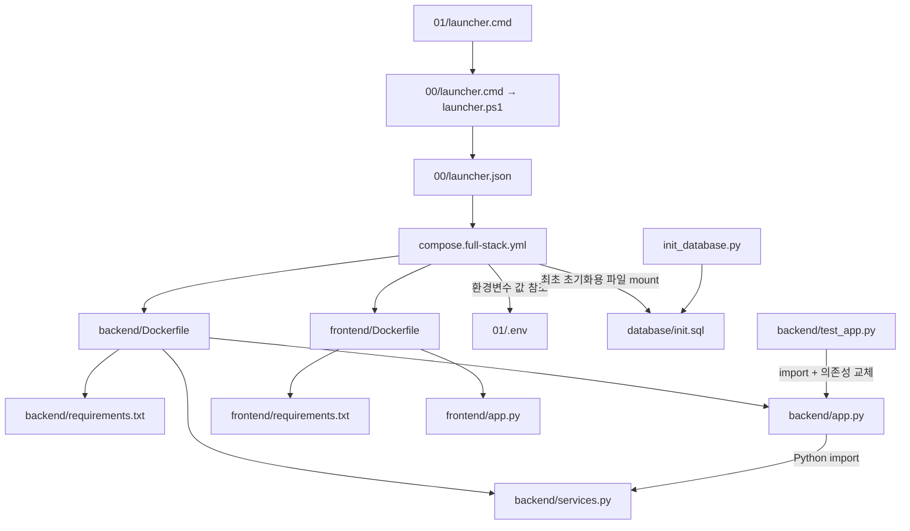
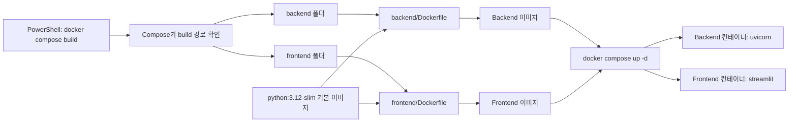
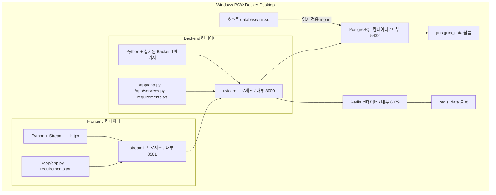
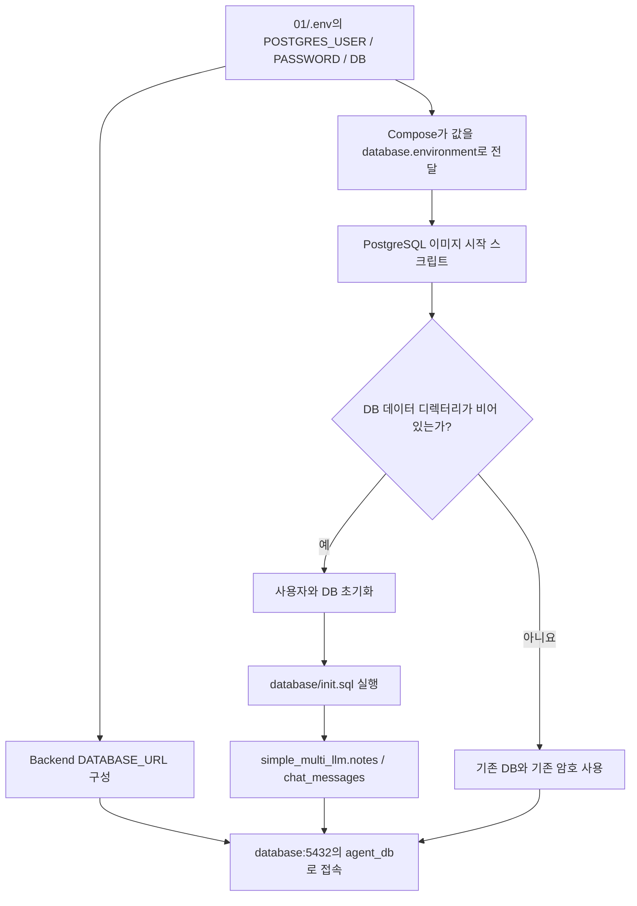
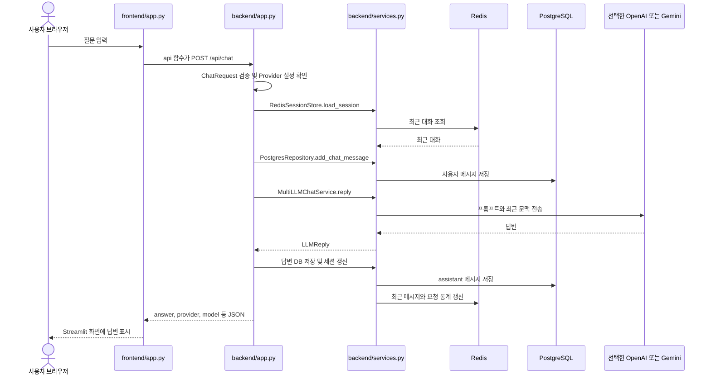
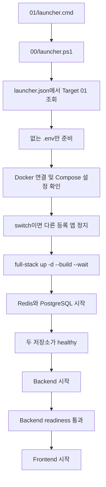
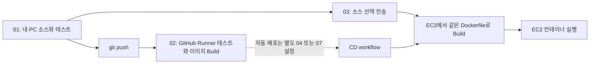

# 01 Deatil — Python 소스가 이미지와 컨테이너가 되는 과정

분석 기준: 2026-09-17의 현재 저장소 코드. 파일명은 요청한 Deatil.md를 사용합니다.
이 문서는 01_simple-multi-llm-compose 원본을 설명합니다. compose2/compose3는 별도 변형입니다.
그림은 코드와 설정에서 확인한 구조이며 실제 Docker 실행 성공을 뜻하지 않습니다.
현재 점검 환경에는 Docker가 없어 컨테이너 Build·기동은 확인하지 못했습니다.

읽는 순서: 파일 지도 → 이미지 생성 → 컨테이너 내부 → 실제 요청 → PowerShell 실행 → CI/CD 연결.

## 1. 먼저 다섯 가지를 구분하기

| 개념 | 이 프로젝트의 예 | 무엇인가 |
| --- | --- | --- |
| 소스 | backend/app.py | Python으로 작성한 동작 |
| 의존성 명세 | backend/requirements.txt | 필요한 FastAPI·Redis 클라이언트 등의 패키지 |
| Dockerfile | backend/Dockerfile | 소스와 패키지로 이미지를 만드는 조립 순서 |
| 이미지 | Compose가 빌드한 backend 이미지 | Python·설치 패키지·앱 코드 등이 담긴 실행 템플릿 |
| 컨테이너 | 실행 중인 backend 서비스 | 이미지를 기반으로 생성한 실행 환경과 프로세스 |

YAML은 Python 프로그램이 아닙니다. Compose가 읽는 서비스 설정입니다.
Dockerfile도 Python 프로그램이 아닙니다. Docker가 읽는 이미지 빌드 명세입니다.
Redis Python 패키지는 Redis 서버에 접속하는 클라이언트이며 Redis 서버 프로세스와 다릅니다.

## 2. 실제 파일 지도

```text
01_simple-multi-llm-compose/
├─ launcher.cmd                 공통 launcher로 명령 전달
├─ .env.example                 비밀값이 없는 설정 예제
├─ .env                         로컬 설정, Git에 올리지 않음
├─ compose.yml                  앱만 빌드, 기존 공용 DB·Redis에 연결
├─ compose.full-stack.yml       앱 + DB + Redis를 함께 실행
├─ compose.release.yml          완성된 앱 이미지 + 기존 공용 DB·Redis
├─ init_database.py             기존 공용 DB에 스키마·테이블 준비
├─ backend/
│  ├─ Dockerfile                Backend 이미지 조립
│  ├─ requirements.txt          Backend Python 의존성
│  ├─ app.py                    FastAPI 객체, 입력 모델, API 라우트
│  ├─ services.py               Redis·PostgreSQL·LLM 실제 연결
│  └─ test_app.py               외부 서비스 대신 Fake를 넣는 테스트
├─ frontend/
│  ├─ Dockerfile                Frontend 이미지 조립
│  ├─ requirements.txt          Streamlit·httpx 의존성
│  └─ app.py                    화면과 Backend HTTP 요청
├─ database/
│  └─ init.sql                  스키마·테이블·인덱스 생성
├─ doc/ConnectGuide.md          접속·실행 안내
└─ docs/Deatil.md               이 구조 학습 문서
```

### 파일 사이의 정적 관계



선은 파일 참조·복사·import 관계입니다. 실행 중 요청 흐름은 뒤의 별도 그림에서 설명합니다.

## 3. 세 Compose 파일을 나눈 이유

| 구분 | compose.yml | compose.full-stack.yml | compose.release.yml |
| --- | --- | --- | --- |
| 앱 준비 | 로컬 소스로 build | 로컬 소스로 build | image 변수로 Registry 이미지 선택 |
| PostgreSQL·Redis | 별도 공용 서비스 | 같은 Compose가 함께 실행 | 별도 공용 서비스 |
| DB 주소 | host.docker.internal:5433 | database:5432 | host.docker.internal:5433 |
| Redis 주소 | host.docker.internal:6379 | redis:6379 | host.docker.internal:6379 |
| 현재 Frontend 공개 포트 | 80 → 8501 | 8501 → 8501 | 8501 → 8501 |
| Backend 공개 포트 | 8000 → 8000 | 8000 → 8000 | 8000 → 8000 |
| 처음 전체 실행 | 공용 서비스 준비 필요 | launcher의 기본 선택 | Registry 이미지·공용 서비스 필요 |

세 파일 중 상황에 맞는 하나를 선택합니다. 세 파일을 순서대로 실행하거나 합치는 방식이 아닙니다.
특히 기본 compose.yml은 현재 80번으로 화면을 공개하므로 http://localhost 로 접속합니다.
launcher가 쓰는 full-stack은 http://localhost:8501 입니다.

## 4. 어떤 명령에서 이미지가 만들어지나요?

실행 장소: Windows PowerShell. 현재 위치: 01_simple-multi-llm-compose.

```powershell
docker compose -f compose.full-stack.yml build
```

Compose의 build: ./backend가 backend 폴더를 빌드 문맥으로 지정합니다.
Docker는 그 안의 Dockerfile을 읽습니다. Frontend도 같은 방식으로 별도 이미지를 만듭니다.
build만으로 서비스 컨테이너를 계속 실행하지는 않습니다.



### Backend Dockerfile을 한 줄씩 해석

| 실제 지시문 | 실행 시점 | 결과 |
| --- | --- | --- |
| FROM python:3.12-slim | 빌드 | Python과 Linux 사용자 공간이 있는 기본 이미지 사용 |
| WORKDIR /app | 빌드·실행 기준 설정 | 뒤의 상대 경로와 서버 작업 폴더를 /app으로 지정 |
| COPY requirements.txt . | 빌드 | backend/requirements.txt를 /app에 복사 |
| RUN pip install --no-cache-dir -r requirements.txt | 빌드 | 이미지 안에 Python 패키지 설치 |
| COPY app.py services.py ./ | 빌드 | 두 소스 파일을 /app에 복사 |
| CMD uvicorn app:app ... | 컨테이너 시작 | FastAPI 서버 프로세스 실행 |

RUN은 빌드 중 실제로 실행됩니다. CMD는 기본 시작 명령을 이미지에 기록하고 컨테이너 시작 때 실행합니다.
requirements를 먼저 복사하는 구조는 앱 코드만 바뀐 경우 의존성 설치 레이어를 재사용하는 데 도움이 됩니다.
캐시 재사용 여부는 실제 변경 내용과 빌드 조건에 따라 달라집니다.

Frontend Dockerfile도 같은 구조이며 마지막 시작 명령이 다릅니다.

```text
Backend:
uvicorn app:app --host 0.0.0.0 --port 8000

Frontend:
streamlit run app.py --server.address=0.0.0.0 --server.port=8501
```

app:app의 앞 app은 app.py 모듈이고, 뒤 app은 app.py 안의 FastAPI 객체입니다.
0.0.0.0은 컨테이너의 모든 네트워크 인터페이스에서 요청을 받는 설정입니다.
브라우저 주소창에는 0.0.0.0 대신 localhost나 EC2 주소를 사용합니다.

## 5. 컨테이너에는 무엇이 들어가나요?



| 대상 | 포함·연결되는 것 | 자동으로 포함되지 않는 것 |
| --- | --- | --- |
| Backend 이미지 | Python, Backend 패키지, app.py, services.py, requirements.txt | frontend 폴더, test_app.py, 호스트 .venvs, 루트 .env |
| Frontend 이미지 | Python, Frontend 패키지, app.py, requirements.txt | Backend 코드, PostgreSQL·Redis 서버 |
| PostgreSQL 컨테이너 | postgres:17-alpine 이미지, 환경변수, SQL mount, 데이터 볼륨 | Windows에 설치한 PostgreSQL의 기존 데이터 |
| Redis 컨테이너 | redis:7-alpine 이미지, Redis 프로세스, AOF 설정, 데이터 볼륨 | Python redis 패키지를 설치했다고 만들어지는 서버 |

PostgreSQL·Redis는 이 프로젝트의 Dockerfile로 빌드하지 않고 준비된 이미지를 사용합니다.
full-stack의 Ollama는 선택 profile입니다. 기본 실행은 네 개의 서비스이며 Ollama 모델도 자동 다운로드되지 않습니다.
호스트 Windows 전체가 이미지에 들어가는 것이 아닙니다.
컨테이너의 쓰기 레이어와 별도로 DB 데이터는 이름 있는 볼륨에 보존합니다.

## 6. .env → DB 사용자 생성 → 테이블 생성



full-stack에서는 .env의 아래 값으로 최초 사용자·DB가 자동 초기화됩니다.

```dotenv
POSTGRES_USER=agent_user
POSTGRES_PASSWORD=agent_pwd
POSTGRES_DB=agent_db
```

database/init.sql은 사용자 생성 파일이 아니라 simple_multi_llm 스키마와 테이블을 만드는 파일입니다.
이미 데이터가 있는 볼륨은 .env만 수정해도 기존 사용자 암호가 바뀌지 않습니다.
데이터 보존이 필요하면 볼륨 삭제로 문제를 해결하지 말고 실제 DB 계정을 확인합니다.

기본/release 구성은 기존 DB를 사용하므로, 01 폴더의 init_database.py로 테이블을 준비합니다.

```powershell
# 실행 장소: Windows PowerShell, 현재 위치: 01 폴더
..\.venvs\compose\Scripts\python.exe .\init_database.py
```

이 프로그램은 .env를 읽고 HOST_DATABASE_URL을 우선 사용해 기존 DB에 접속한 뒤 init.sql을 실행합니다.
POSTGRES_USER나 DB 자체를 새로 생성하지 않습니다. full-stack의 최초 초기화에서는 따로 실행할 필요가 없습니다.

## 7. 실제 채팅 요청은 어느 Python 파일을 지나나요?



브라우저가 services.py를 실행하지 않습니다. 브라우저는 Streamlit 화면과 통신하고,
Frontend 컨테이너의 Python이 httpx로 Backend를 호출합니다.
services.py의 RedisSessionStore는 최근 문맥을, PostgresRepository는 전체 이력을 담당합니다.
MultiLLMChatService.reply는 선택한 Provider 하나를 호출합니다. Ollama 선택 시 HTTP /api/chat을 사용합니다.
전체 흐름은 단일 트랜잭션이 아니므로 모델 호출 실패 전에 저장한 사용자 메시지는 남을 수 있습니다.
현재 코드는 작업 큐·토큰 스트리밍·자동 Provider 대체를 구현하지 않습니다.

### API와 파일 대응

| API | app.py 함수 | 실제 작업 |
| --- | --- | --- |
| GET /health/live | live | Backend 프로세스 생존 응답 |
| GET /health | health | Redis·DB·테이블·Provider 설정 상태 반환 |
| GET /health/ready | ready | 의존성 준비 실패 시 HTTP 503 |
| POST /api/chat | chat | Redis 문맥 → DB → LLM → DB/Redis 갱신 |
| GET /api/chat/{session_id} | get_chat_history | PostgreSQL 이력 조회 |
| POST /api/notes | create_note | PostgreSQL 메모 저장, Redis 통계 |
| GET /api/notes | get_notes | PostgreSQL 메모 조회 |
| GET /api/stats | get_stats | Redis 요청 통계 |
| DELETE /api/sessions/{session_id} | reset_current_session | Redis 문맥 삭제, PostgreSQL 이력 유지 |

/health가 HTTP 200이어도 JSON status가 degraded일 수 있습니다.
Docker healthcheck는 /health/ready를 사용합니다.
Provider 키가 실제로 유효한지 모델을 호출해서 검사하지 않으므로 healthy와 실제 LLM 성공은 별도입니다.

## 8. PowerShell에서 처음부터 실행하기

실행 장소는 Windows입니다. 아래에서 01 폴더로 한 번 이동한 뒤 이어서 실행합니다.

```powershell
Set-Location -LiteralPath 'C:\수업 보관소\aidevs-latest\aidevs-main\aidevs-main\07_multi-agent-service-ops\00_runtime-and-deployment\01_simple-multi-llm-compose'
docker version
docker compose version
.\launcher.cmd -Target 01 -Action init
notepad .\.env
```

.env에서 OpenAI 또는 Gemini 키와 사용할 모델을 지정합니다.
해당 Provider를 사용하는 경우 OLLAMA_ENABLED=false로 두면 됩니다.
실제 키는 문서·Dockerfile·Git 커밋에 넣지 않습니다.

```powershell
# 다른 등록 실습을 정지하고 01로 전환. DB 볼륨은 보존.
.\launcher.cmd -Target 01 -Action switch

# 상태, 로그, 브라우저
.\launcher.cmd -Target 01 -Action status
.\launcher.cmd -Target 01 -Action logs
.\launcher.cmd -Target 01 -Action open
```

Frontend: http://localhost:8501 / Backend 문서: http://localhost:8000/docs

### launcher 내부에서 일어나는 일



start는 다른 실습을 정지하지 않습니다. switch는 다른 등록 앱을 정지합니다.
00 공용 인프라는 switch 정지 대상이 아닙니다.
01·01-2·01-3은 기존 Compose 프로젝트 이름과 볼륨을 공유합니다.

### 같은 일을 Docker 명령으로 나누어 보기

```powershell
docker compose -f compose.full-stack.yml config --quiet
docker compose -f compose.full-stack.yml build
docker compose -f compose.full-stack.yml up -d --wait
docker compose -f compose.full-stack.yml ps
Invoke-RestMethod http://localhost:8000/health/ready
docker compose -f compose.full-stack.yml exec redis redis-cli ping
docker compose -f compose.full-stack.yml exec database psql -U agent_user -d agent_db -c "SELECT current_database(), current_user;"
```

계정/DB를 바꿨다면 마지막 명령의 이름도 맞춥니다. Redis 정상 응답은 PONG입니다.
start/up 실행은 위 Python 파일을 Windows에서 직접 실행하는 것이 아니라 컨테이너의 CMD를 시작합니다.

| 명령 | 이미지·컨테이너·데이터에 미치는 영향 |
| --- | --- |
| config --quiet | 설정 검사 |
| build | 이미지 생성·갱신 |
| up -d --build | 빌드 후 컨테이너 생성·필요 시 재생성·시작 |
| restart | 기존 컨테이너 재시작, 새 소스를 빌드하지 않음 |
| logs --tail 80 backend | Backend stdout/stderr 조회 |
| stop | 컨테이너 정지, 컨테이너와 볼륨 보존 |
| down | Compose 컨테이너와 네트워크 제거, 기본적으로 이름 있는 볼륨 보존 |
| down -v | 볼륨까지 삭제하므로 데이터가 사라질 수 있음; 일반 재시작에 사용하지 않음 |

현재 Dockerfile은 소스를 COPY하고 앱 소스 bind mount는 없습니다.
따라서 호스트 app.py 수정 후에는 up -d --build로 다시 반영합니다.

## 9. venv와 Docker 패키지를 구분하기

호스트 .venvs/compose는 Windows에서 테스트나 init_database.py를 실행할 때 사용합니다.
Docker 이미지는 Dockerfile의 RUN pip install로 별도 패키지를 설치합니다.
VS Code의 import redis 밑줄은 선택한 호스트 Python 환경과 관련될 수 있고, Docker의 Redis health와는 별개입니다.

```powershell
# 실행 장소: Windows PowerShell, 현재 위치: 01 폴더
.\launcher.cmd -Target 01 -Action setup
.\launcher.cmd -Target 01 -Action test
```

test_app.py는 FastAPI 의존성을 FakeRedis, FakeDatabase, FakeLLM으로 바꿉니다.
이 테스트 성공이 실제 DB 연결·LLM 키·Docker 네트워크의 성공을 보장하지는 않습니다.

## 10. 02 CI와 03 EC2로 연결하기



현재 02 CI가 만든 이미지가 자동으로 EC2에 옮겨지는 구조는 아닙니다.
자세한 흐름은 [02 Deatil](../../02_github-actions-ci/docs/Deatil.md)과
[03 Deatil](../../03_aws-ec2/docs/Deatil.md)을 이어서 읽습니다.

## 11. 근거 파일과 스스로 확인할 질문

근거: [Backend Dockerfile](../backend/Dockerfile), [Frontend Dockerfile](../frontend/Dockerfile),
[Backend API](../backend/app.py), [연결 서비스](../backend/services.py), [화면](../frontend/app.py),
[DB 초기화 SQL](../database/init.sql), [DB 준비 도구](../init_database.py),
[full-stack](../compose.full-stack.yml), [기본 Compose](../compose.yml),
[release Compose](../compose.release.yml), [테스트](../backend/test_app.py),
[JSON launcher](../../launcher.json), [launcher 구현](../../launcher.ps1).

- build만 실행했을 때 웹페이지가 열리는가? 서버 시작은 어떤 명령인가?
- 왜 backend/app.py와 frontend/app.py는 같은 파일명이어도 충돌하지 않는가?
- .env는 이미지에 COPY되는가, 실행 환경변수로 전달되는가?
- /health가 200인데 /health/ready가 503일 수 있는가?
- .env의 DB 암호 변경만으로 이미 만들어진 DB 암호도 바뀌는가?
- Windows의 localhost와 컨테이너의 localhost는 같은 대상을 뜻하는가?

갱신 방법: Dockerfile의 COPY/CMD, Compose의 build/image/ports/volumes, app.py의 라우트,
services.py의 호출 순서를 다시 읽고 해당 표·Mermaid를 함께 수정합니다.

문서 검증: 내부 파일 링크와 코드 블록 경계를 확인했고, 이 문서의 Mermaid 7개를 로컬 Mermaid 엔진과 headless Edge에서 SVG로 렌더링했습니다. Docker·GitHub·EC2 명령을 실제로 실행한 검증과는 별개입니다.
