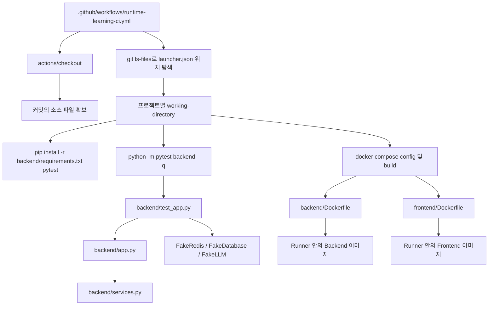
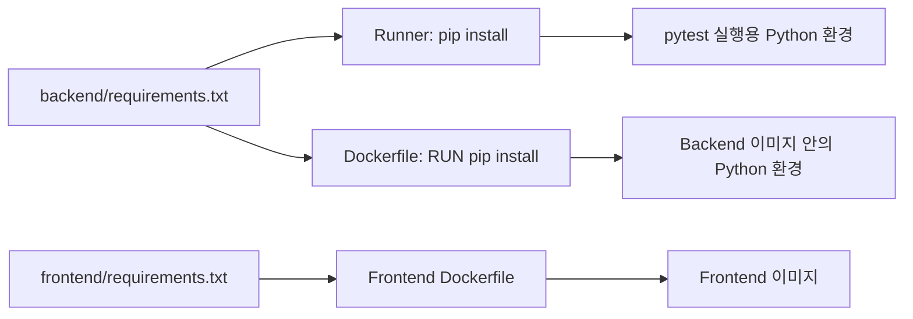
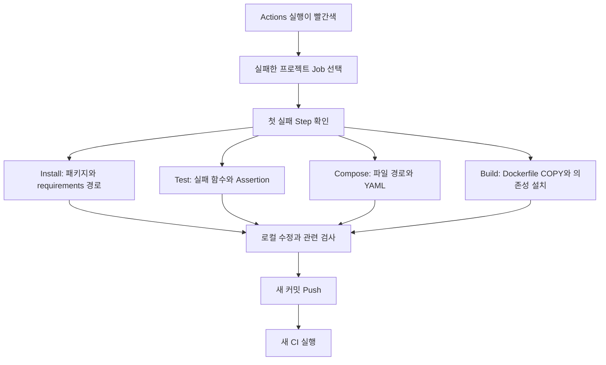
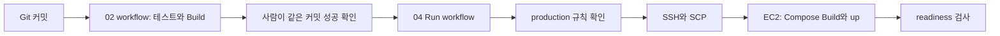
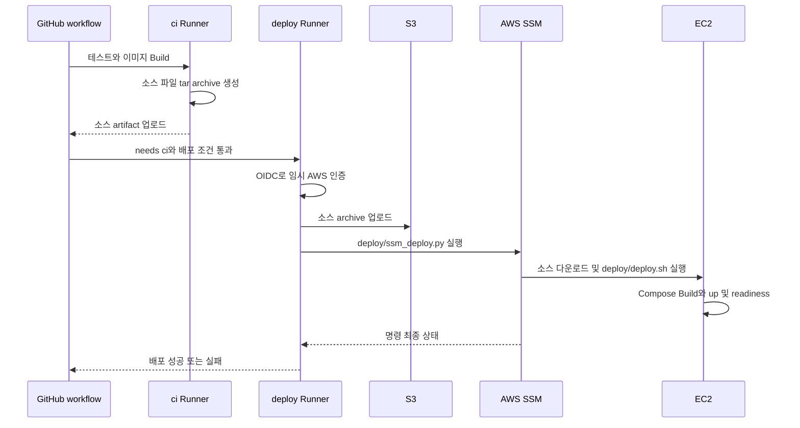

# 02 Deatil — GitHub Actions에서 Python 테스트와 Docker 이미지가 만들어지는 흐름

분석 기준: 현재 [runtime-ci.yml](../runtime-ci.yml), 01의 Python·Dockerfile, 별도 CD 예제.
02는 새로운 웹 서버 프로젝트가 아닙니다. 01 등 다른 실습의 코드를 자동 검사하는 workflow 학습 단계입니다.
02 안에 backend/app.py나 Dockerfile이 없는 것은 누락이 아닙니다.
이 문서는 설정의 실행 경로를 설명하며 GitHub에 Push하거나 AWS에 실제 배포한 결과는 아닙니다.

이 문서에서 사용할 CI 이름은 **Runtime Learning CI**입니다.
기존 README의 07 Runtime CI 또는 다른 기존 workflow와 이름·트리거·범위가 다를 수 있습니다.

## 1. 실행 장소부터 구분하기

| 장소 | 누가 실행하는가 | 이 단계에서 하는 일 |
| --- | --- | --- |
| Windows PowerShell | 개발자 | 파일 수정, 로컬 테스트, git commit/push |
| GitHub 저장소 | GitHub | workflow YAML과 커밋 보관 |
| GitHub-hosted Runner | GitHub가 준비한 Linux VM | Python 설치, 테스트, Compose 검사, 이미지 Build |
| EC2 | 이후 수동 작업 또는 CD | 지속적으로 서비스 컨테이너 실행 |

Runner와 EC2는 같은 서버가 아닙니다.
내 PC의 .venvs, .env, Docker 컨테이너는 Runner에 자동으로 따라가지 않습니다.
git push는 Git이 추적하는 커밋을 보내는 것이며 Windows 실행 환경 전체를 업로드하지 않습니다.

```mermaid
flowchart LR
    Dev["Windows: 코드 수정"] --> Commit["git commit"]
    Commit --> Push["git push"]
    Push --> Repo["GitHub 저장소"]
    Repo --> Event["push 또는 pull_request 또는 수동 실행"]
    Event --> Runner["새 Linux Runner"]
    Runner --> Install["Python과 Backend 패키지 설치"]
    Install --> Test["pytest"]
    Test --> Config["Compose 설정 검사"]
    Config --> Build["Docker 이미지 Build"]
    Build --> Result["CI 성공 표시"]
    Result -.->|"별도 CD 설정 전에는 연결되지 않음"| EC2["EC2 서비스"]
```



## 2. 파일 지도와 위치 규칙

```text
Git 저장소 최상위/
└─ .github/
   └─ workflows/
      └─ runtime-learning-ci.yml       GitHub가 실제로 읽는 위치

07_multi-agent-service-ops/
└─ 00_runtime-and-deployment/
   ├─ launcher.json                    CI가 runtime 경로를 찾는 기준 파일
   ├─ 01_simple-multi-llm-compose/
   │  ├─ backend/test_app.py            pytest가 실행하는 파일
   │  ├─ backend/app.py                 테스트가 import하는 FastAPI 앱
   │  ├─ backend/services.py            앱이 import하는 구현
   │  ├─ backend/requirements.txt       Runner의 패키지 설치 명세
   │  ├─ backend/Dockerfile             Backend 이미지 Build
   │  ├─ frontend/Dockerfile            Frontend 이미지 Build
   │  └─ compose.full-stack.yml         build 경로와 서비스 설정
   └─ 02_github-actions-ci/
      ├─ runtime-ci.yml                복사해 사용할 CI 예제
      ├─ launcher.cmd                 공통 launcher 진입점
      ├─ doc/ConnectGuide.md           GitHub 설정 화면 안내
      └─ docs/Deatil.md                이 문서
```

Git 루트는 터미널의 git rev-parse --show-toplevel로 확인합니다.
07 폴더를 Git 루트라고 가정하지 않습니다. 현재 로컬 디렉터리는 더 큰 저장소 안에 있습니다.
예제를 docs나 02 폴더에 두는 것만으로 GitHub Actions가 활성화되지는 않습니다.

## 3. 어느 파일이 어느 파일을 실행하나요?



01 기준으로 pytest가 실행하는 테스트는 test_app.py의 세 함수입니다.
FastAPI TestClient는 실제 8000 포트에 장기 서버를 띄우지 않고 앱에 테스트 요청을 전달합니다.
dependency_overrides가 저장소·LLM 의존성을 Fake 객체로 바꿉니다.

| 01 테스트 함수 | 검사 내용 |
| --- | --- |
| test_health_shows_each_provider | Provider 설정 여부 응답 |
| test_selected_provider_is_visible_and_history_is_saved | 선택 Provider·답변 계약·이력 저장 흐름 |
| test_unconfigured_provider_is_not_replaced_with_mock | 미설정 Provider의 실패 처리 |

실제 SQL 문법, Redis TTL, 네트워크, LLM 인증 성공까지 검증하는 테스트는 아닙니다.
01 말고 05·06·07 Job에서는 각각 그 프로젝트의 backend 테스트가 실행됩니다.

## 4. YAML을 위에서부터 읽기

현재 runtime-ci.yml의 구조를 설명용으로 축약하면 다음과 같습니다.

```yaml
name: Runtime Learning CI
on:
  push:
  pull_request:
  workflow_dispatch:
permissions:
  contents: read
jobs:
  test-and-build:
    runs-on: ubuntu-latest
    strategy:
      fail-fast: false
      matrix:
        project:
          - 01_simple-multi-llm-compose
          # 나머지 5개 실습도 실제 파일에 정의되어 있음
```

| 항목 | 의미 | 이번 코드의 동작 |
| --- | --- | --- |
| name | Actions 화면의 이름 | Runtime Learning CI |
| push | 원격 저장소에 커밋이 올라온 이벤트 | 현재 예제는 브랜치·경로 필터 없음 |
| pull_request | PR 생성·갱신 등 이벤트 | PR 코드 검사 |
| workflow_dispatch | 수동 시작 이벤트 | Actions의 Run workflow |
| contents: read | 저장소 읽기 권한 | 소스 Checkout |
| jobs | 작업 묶음 | test-and-build |
| runs-on | 실행 VM | GitHub의 ubuntu-latest |
| matrix.project | 프로젝트별 Job 확장 | 01·01-2·01-3·05·06·07 |
| fail-fast: false | 한 matrix Job 실패 시 처리 | 다른 프로젝트 Job은 계속 검사 |
| steps | Job 안의 순서 | Checkout → Python → Locate → Install → Test → Build |
| working-directory | 해당 run 명령의 기준 폴더 | 찾아낸 runtime 경로 + matrix.project |

같은 Job의 단계는 앞 단계가 성공해야 기본적으로 다음 단계로 넘어갑니다.
matrix Job들은 별도 실행 환경을 사용하므로 01의 Gemini SDK 2.x와 07의 1.x가 같은 환경에서 충돌하지 않습니다.

### Locate runtime의 역할

이 단계는 Git이 추적하는 경로 중 아래 조건에 맞는 파일을 찾습니다.

```text
*00_runtime-and-deployment/launcher.json
```

정확히 하나여야 합니다. 없으면 launcher.json이 커밋되지 않았는지 확인합니다.
둘 이상이면 실습 사본이 중복 포함되었는지 확인합니다.
이 방식은 저장소 안의 aidevs-main 폴더 깊이가 달라도 프로젝트를 찾기 위한 것입니다.

## 5. Runner에서 설치하는 패키지와 이미지 안의 패키지



Runner의 pip install은 테스트를 위한 설치입니다.
Dockerfile의 pip install은 실행 이미지를 위한 설치입니다. 둘은 설치 장소가 다릅니다.
같은 requirements를 사용해도 한 번 설치한 결과를 자동 공유하는 구조는 아닙니다.

## 6. CI의 Build가 하는 일과 하지 않는 일

현재 예제의 프로젝트별 분기:

| 파일 존재 여부 | 실제 검사·Build |
| --- | --- |
| compose.infrastructure.yml 있음 | infrastructure와 application 설정 검사, application Build |
| compose.full-stack.yml 있음 | full-stack 설정 검사 및 Build |
| 그 외 | compose.yml 설정 검사 및 Build |

01의 Build는 Backend·Frontend 이미지를 Runner 안에 만듭니다.
PostgreSQL·Redis는 image로 지정된 외부 이미지이며 자체 Dockerfile Build 대상이 아닙니다.
현재 CI에는 서비스 up, Registry push, EC2 배포, 이미지 artifact 업로드가 없습니다.
Runner에서 만든 이미지를 나중에 EC2가 자동으로 사용할 수 있다고 생각하면 안 됩니다.

## 7. Windows PowerShell에서 CI 준비하기

실행 장소: Windows PowerShell. 처음에는 02 폴더로 이동합니다.

```powershell
Set-Location -LiteralPath 'C:\수업 보관소\aidevs-latest\aidevs-main\aidevs-main\07_multi-agent-service-ops\00_runtime-and-deployment\02_github-actions-ci'
$runtimeRoot = (Resolve-Path '..').Path
$repoRoot = git rev-parse --show-toplevel
if ($LASTEXITCODE -ne 0) { throw 'Git 저장소 안에서 실행하세요.' }
```

로컬에서 먼저 01을 검사합니다.

```powershell
& (Join-Path $runtimeRoot 'launcher.cmd') -Target 01 -Action test
& (Join-Path $runtimeRoot 'launcher.cmd') -Target 01 -Action check
Push-Location (Join-Path $runtimeRoot '01_simple-multi-llm-compose')
docker compose -f compose.full-stack.yml build
Pop-Location
```

test는 설치된 호스트 venv, check/build는 Docker Desktop을 사용합니다.
Docker가 없다면 test는 가능해도 check/build는 할 수 없습니다.

### Workflow를 Git 루트에 복사

```powershell
$workflowDir = Join-Path $repoRoot '.github/workflows'
New-Item -ItemType Directory -Force -Path $workflowDir | Out-Null
$destination = Join-Path $workflowDir 'runtime-learning-ci.yml'
if (Test-Path -LiteralPath $destination) {
    throw '같은 workflow가 있습니다. 기존 파일과 비교 후 갱신하세요.'
}
Copy-Item -LiteralPath '.\runtime-ci.yml' -Destination $destination
```

### 커밋·Push 전에 확인

```powershell
git status --short
git remote -v
git branch --show-current
git add -- "$destination"
git add -- (Join-Path $runtimeRoot 'launcher.json')
git diff --cached --name-only
```

위 두 파일뿐 아니라 CI matrix에 나열된 실습 소스·requirements·Dockerfile·SQL·Compose가
원격 커밋에도 있어야 합니다. 아직 추적하지 않는 소스가 있다면 변경 목록에서 해당 파일만 추가합니다.
.env, .venvs, PEM, API 키는 추가하지 않습니다. git add .로 모든 개인 파일을 무조건 넣지 않습니다.

검토한 뒤:

```powershell
git commit -m "Add runtime learning CI"
git push
```

upstream이 없는 브랜치라면 Git이 안내하는 origin과 현재 브랜치 이름을 확인해 연결합니다.
권한이 없는 수업 원본 저장소라면 본인의 Fork나 본인 저장소를 사용합니다.

## 8. GitHub 화면에서 실행 결과 확인

1. GitHub 저장소의 Actions 탭을 엽니다.
2. Runtime Learning CI를 선택합니다.
3. 실행의 Branch와 Commit이 방금 Push한 변경인지 확인합니다.
4. 프로젝트별 Job을 열고 가장 먼저 실패한 Step을 펼칩니다.
5. 여섯 프로젝트가 모두 성공하면 CI 완료입니다.

수동 실행은 Run workflow → Branch 선택 → Run workflow입니다.
버튼을 사용하려면 workflow_dispatch가 있고 workflow가 기본 브랜치에 있어야 합니다.
개발 브랜치에만 있다면 Push 이벤트로 먼저 확인하고 PR로 기본 브랜치에 반영합니다.
Git pull은 원격 코드를 내려받는 명령이며 그 자체가 GitHub의 pull_request 이벤트는 아닙니다.



네트워크 다운로드 같은 일시 오류에는 Re-run failed jobs를 사용할 수 있습니다.
코드를 고쳤다면 새 커밋을 Push해야 수정한 코드로 새 실행이 만들어집니다.

## 9. CI와 CD를 실제 코드 기준으로 구분

| 경로 | CI | CD 시작 | EC2에서 하는 일 |
| --- | --- | --- | --- |
| 이 02 runtime-ci.yml | 테스트·Compose 검사·앱 Build | 없음 | 변경 없음 |
| 04 SSH 배포 예제 | 별도 CI 성공을 사람이 확인 | workflow_dispatch | 소스 scp 후 EC2에서 Build·up |
| 07 통합 workflow | ci Job | needs: ci + main/수동 조건 | S3 소스 archive를 받아 EC2에서 Build·up |

현재 04는 02의 CI 성공을 자동으로 확인하는 needs 연결이 없습니다.
동일 커밋의 CI 성공을 운영자가 먼저 확인해야 합니다.
07의 needs: ci는 같은 workflow 안의 ci Job에 대한 의존성입니다. 02 workflow와의 연결이 아닙니다.



production 승인 화면은 Environment에 해당 보호 규칙을 설정한 경우에만 나옵니다.
GitHub-hosted Runner는 내 PC와 IP가 달라 내 IP만 허용한 EC2 SSH에 바로 접속할 수 없습니다.
SSH 전체 공개로 해결하지 말고 [CD 연결 가이드](../../04_github-actions-aws-deploy/doc/ConnectGuide.md)의 경로를 따릅니다.

## 10. 07 통합 workflow에서는 어느 Python이 실행되나요?

이 절은 다음 단계의 비교입니다. 01 프로젝트에 07 파일을 그대로 섞지 않습니다.



ssm_deploy.py는 Runner에서 AWS API를 호출하는 배포 도구입니다.
backend/app.py는 EC2의 Backend 컨테이너에서 실행되는 앱입니다.
deploy.sh는 EC2에서 Docker 명령을 실행하는 bash 스크립트입니다.
현재 07도 CI에서 만든 Docker 이미지를 Registry에서 내려받는 방식이 아니라 소스를 전달해 EC2에서 다시 빌드합니다.

07 원본은 main Push 시에도 CI 후 CD가 실행되는 조건입니다.
첫 설정은 [04 가이드](../../04_github-actions-aws-deploy/doc/ConnectGuide.md)의 수동 배포 조건부터 적용합니다.
실제 AWS 계정·역할·버킷·SSM·Environment 변수 설정이 있어야 배포할 수 있습니다.

## 11. 학습 완료 기준과 근거

- Push, PR, 수동 실행 이벤트를 구분할 수 있다.
- Runner와 EC2가 별도 컴퓨터라는 점을 설명할 수 있다.
- 어떤 test_app.py가 실행됐는지 matrix와 working-directory에서 찾을 수 있다.
- CI에서 만든 이미지가 현재 어디에 남는지 설명할 수 있다.
- 02 CI 성공만으로 EC2 서비스가 갱신되지 않는 이유를 설명할 수 있다.

근거: [현재 CI 예제](../runtime-ci.yml), [01 테스트](../../01_simple-multi-llm-compose/backend/test_app.py),
[01 Backend Dockerfile](../../01_simple-multi-llm-compose/backend/Dockerfile),
[04 SSH 배포](../../04_github-actions-aws-deploy/07-runtime-deploy-example.yml),
[07 workflow](../../07_integrated-bedrock-mcp/deploy/github-actions.yml),
[07 배포 Python](../../07_integrated-bedrock-mcp/deploy/ssm_deploy.py),
[07 EC2 bash](../../07_integrated-bedrock-mcp/deploy/deploy.sh).

이전: [01 소스·이미지·컨테이너](../../01_simple-multi-llm-compose/docs/Deatil.md).
다음: [03 EC2에서 실제 실행](../../03_aws-ec2/docs/Deatil.md).

갱신 방법: runtime-ci.yml의 on/jobs/matrix/steps와 CD 조건을 다시 읽고 각 실행 위치·파일명을 대조합니다.
테스트 성공, Docker Build 성공, EC2 배포 성공을 별도 증거로 기록합니다.

문서 검증: 내부 파일 링크와 코드 블록 경계를 확인했고, 이 문서의 Mermaid 6개를 로컬 Mermaid 엔진과 headless Edge에서 SVG로 렌더링했습니다. Docker·GitHub·EC2 명령을 실제로 실행한 검증과는 별개입니다.
