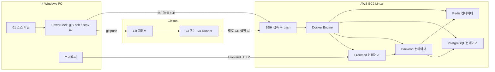
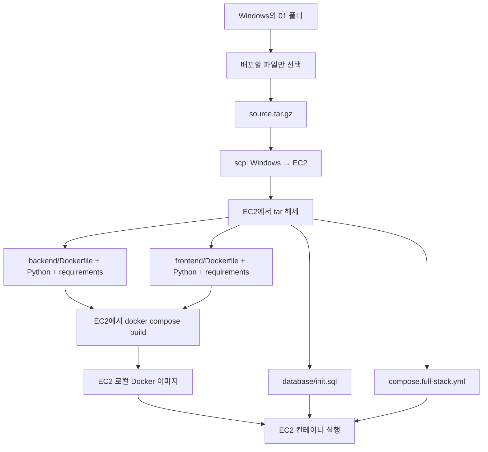
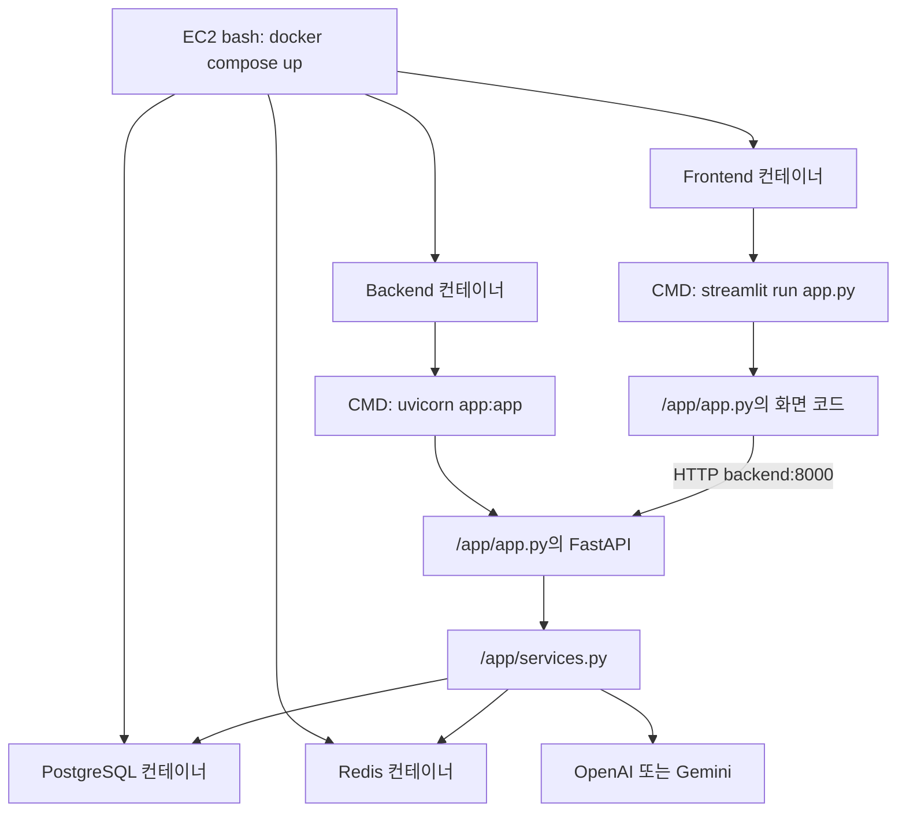
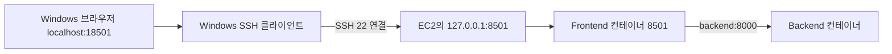
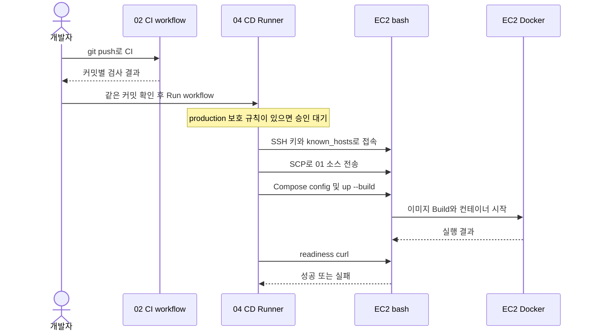
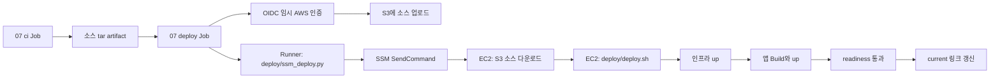

# 03 Deatil — 내 PC의 소스를 EC2의 실행 중인 서비스로 바꾸기

분석 기준: 현재 01의 Dockerfile·full-stack Compose, 03의 배포 안내, 04·07의 CD 예제.
03 폴더는 EC2 실습 안내서입니다. 별도 app.py를 실행하는 폴더가 아니며, 기본 실습 대상은 01 앱입니다.
이 문서의 EC2 명령은 실행 방법입니다. 문서 작성 중 실제 EC2 생성·접속·배포는 수행하지 않았습니다.

이 문서에서는 수동 배포와 04 SSH CD의 경로를 맞추기 위해
EC2 배포 위치를 ~/aidevs-runtime/01_simple-multi-llm-compose로 통일합니다.
기존 안내의 ~/simple-compose에 이미 배포했다면 중복 실행하지 말고 실제 사용 경로를 하나로 맞추세요.

## 1. Windows, GitHub Runner, EC2, 컨테이너는 서로 다른 실행 환경



SSH로 접속한 터미널에서 실행하는 docker 명령은 EC2의 Docker에 전달됩니다.
Windows에서 실행한 docker 명령은 일반적인 로컬 설정에서는 Docker Desktop에 전달됩니다.
같은 docker compose up 명령이어도 어느 컴퓨터에서 실행했는지가 중요합니다.

## 2. 03 파일은 무엇을 설명하나요?

| 파일 | 역할 |
| --- | --- |
| 01_architecture-and-cost.md | EC2 한 대의 실습 구조와 비용 고려 |
| 02_create-ec2.md | 인스턴스·네트워크 생성 |
| 03_install-and-transfer.md | SSH, Docker 설치, 코드 전송 |
| 04_deploy-and-verify.md | Compose 실행, health, 로그 |
| 05_failure-lab.md | 장애 실습 |
| 06_cleanup.md | 실습 리소스 정리 |
| doc/ConnectGuide.md | 연결 명령 요약 |
| docs/Deatil.md | 파일·실행 위치·CI/CD 전체 흐름 |

실제로 배포할 Python과 Dockerfile은 [01 폴더](../../01_simple-multi-llm-compose/README.md)에 있습니다.
03의 launcher 항목은 가이드를 열며 로컬에서 EC2를 생성하거나 SSH 접속하지 않습니다.

## 3. 서버 준비 전 확인할 것

[EC2 생성 안내](../02_create-ec2.md)에 따라 본인 계정에서 서버를 준비합니다.
AMI는 Ubuntu 또는 Amazon Linux 중 자신이 선택한 것을 확인합니다.

| 값 | 예 또는 확인 위치 | 사용처 |
| --- | --- | --- |
| Public IPv4 / DNS | EC2 인스턴스 Details | 내 PC의 SSH 접속 대상 |
| 로그인 사용자 | Ubuntu는 ubuntu, Amazon Linux는 ec2-user | SSH 로그인 |
| PEM 경로 | 생성 시 내려받은 키, 저장소 밖에 보관 | SSH 인증 |
| Region | AWS 콘솔의 실제 Region | AWS CLI·SSM 배포 |
| Instance ID | i-로 시작 | 이후 07 SSM 배포 |

보안그룹은 서버로 들어오는 연결을 제어합니다.
내 PC에서 SSH를 사용할 때 22번은 내 IP로 제한합니다.
PostgreSQL 5432, Redis 6379, Backend 8000을 외부 브라우저 사용을 위해 공개할 필요는 없습니다.
Frontend 8501은 허용한 클라이언트 IP에만 열거나 아래 SSH 터널로 접근합니다.
IAM 역할은 AWS API 권한이며 보안그룹의 네트워크 허용과 역할이 다릅니다.

## 4. Windows PowerShell에서 SSH 접속

실행 장소: Windows PowerShell. 아래 세 값은 본인 환경으로 수정합니다.
EC2 사용자 이름을 Windows 사용자 이름과 혼동하지 마세요.

```powershell
$ec2Address = '본인_EC2_PUBLIC_IP_또는_DNS'
$ec2User = 'ubuntu'
$keyPath = 'C:\Users\사용자\.ssh\수업용키.pem'
Test-NetConnection $ec2Address -Port 22
ssh -i $keyPath "${ec2User}@${ec2Address}"
```

최초 연결에서는 대상 서버의 Host Key 지문을 신뢰할 수 있는 경로로 확인합니다.
SSH 접속 성공 후 프롬프트가 ubuntu@... 또는 ec2-user@...로 바뀌면 아래 명령은 EC2 Linux에서 실행됩니다.

```bash
whoami
hostname
pwd
docker version
docker compose version
```

Docker가 아직 없다면 [OS별 설치 안내](../03_install-and-transfer.md)를 먼저 진행합니다.
이 안내의 Ubuntu 명령을 Amazon Linux에서 그대로 실행하지 않습니다.
설치 후 일반 로그인 사용자에게 Docker 접근 권한이 적용됐는지 재접속하여 확인합니다.
앱 Python과 패키지는 Docker 이미지 안에 설치되므로 EC2 호스트에 Windows venv를 복사하지 않습니다.

```bash
# EC2 bash에서 입력하면 SSH 접속을 종료하고 Windows로 돌아옴
exit
```

## 5. 무엇을 서버로 보내야 하나요?

수동 배포에서는 소스를 보낸 뒤 EC2에서 이미지를 빌드합니다.
Windows에서 만든 .venvs와 .env는 전송하지 않습니다.
이 단계에서는 Docker 이미지 파일 자체를 전송하지 않습니다.



### 필요한 파일만 묶기

실행 장소: Windows PowerShell. 아래 source 경로는 현재 프로젝트 기준입니다.
패키지를 만드는 tar.exe는 Windows에서 실행됩니다.

```powershell
$source = 'C:\수업 보관소\aidevs-latest\aidevs-main\aidevs-main\07_multi-agent-service-ops\00_runtime-and-deployment\01_simple-multi-llm-compose'
$package = Join-Path $env:TEMP 'runtime01-source.tar.gz'
$files = @(
    'backend/Dockerfile',
    'backend/requirements.txt',
    'backend/app.py',
    'backend/services.py',
    'frontend/Dockerfile',
    'frontend/requirements.txt',
    'frontend/app.py',
    'database/init.sql',
    'compose.full-stack.yml',
    '.env.example'
)
tar.exe -czf $package -C $source @files
if ($LASTEXITCODE -ne 0) { throw '소스 압축 실패' }
tar.exe -tzf $package
```

목록에 .env, .venvs, 개인 키가 없어야 합니다.
backend/test_app.py는 CI에서 사용하며 현재 서비스 이미지 실행에 필요하지 않습니다.
init_database.py도 full-stack 최초 초기화에서는 필요하지 않습니다.

### EC2에 전송

실행 장소: 위 변수들이 설정된 같은 Windows PowerShell.

```powershell
ssh -i $keyPath "${ec2User}@${ec2Address}" 'mkdir -p ~/aidevs-runtime/01_simple-multi-llm-compose'
scp -i $keyPath $package "${ec2User}@${ec2Address}:~/aidevs-runtime/01_simple-multi-llm-compose/source.tar.gz"
ssh -i $keyPath "${ec2User}@${ec2Address}"
```

ssh/scp 실패 시 다음 명령을 반복하기 전에 주소·키·사용자·보안그룹을 확인합니다.
키 파일 ACL 문제는 [기존 설치 문서](../03_install-and-transfer.md)의 Windows 권한 안내를 따릅니다.

## 6. EC2에서 환경변수와 파일 준비

이제 실행 장소는 **SSH 접속 후 EC2 bash**입니다.

```bash
cd ~/aidevs-runtime/01_simple-multi-llm-compose
tar -xzf source.tar.gz
ls
if [ ! -f .env ]; then cp .env.example .env; fi
chmod 600 .env
nano .env
```

.env의 실제 OpenAI 또는 Gemini 키와 모델을 설정합니다.
POSTGRES_USER, POSTGRES_PASSWORD, POSTGRES_DB는 이 EC2에서 생성할 DB의 설정입니다.
기존 .env가 있으면 그대로 두고 필요한 항목만 편집합니다.
실제 .env 내용을 GitHub 로그에 출력하거나 Git에 올리지 않습니다.

EC2에서 Backend가 접속할 주소는 full-stack Compose에 이미 다음처럼 정의되어 있습니다.

```text
Redis: redis://redis:6379/0
PostgreSQL: postgresql://사용자:암호@database:5432/DB이름
Frontend가 보는 Backend: http://backend:8000
```

이 서비스 이름은 같은 Docker 네트워크에서 해석됩니다.
EC2의 Public IP를 이 내부 주소들에 넣을 필요가 없습니다.
Windows에 실행 중이던 DB에 자동 연결되는 구성도 아닙니다.

## 7. EC2에서 Build와 실행

실행 장소: EC2 bash. 현재 위치는 위의 배포 폴더입니다.

```bash
docker compose -f compose.full-stack.yml config --quiet
docker compose -f compose.full-stack.yml build
docker compose -f compose.full-stack.yml up -d --wait --wait-timeout 180
docker compose -f compose.full-stack.yml ps
curl --fail http://127.0.0.1:8000/health/ready
curl -I http://127.0.0.1:8501
```

앞 명령이 실패했다면 그 오류부터 해결하고 다음 단계로 넘어갑니다.
한 줄로 실행할 때는 up -d --build --wait를 사용할 수 있습니다.
-d는 SSH 화면을 점유하지 않고 컨테이너를 백그라운드로 실행합니다.

### EC2에서 어느 Python이 시작되나요?



Backend와 Frontend의 /app/app.py는 서로 다른 컨테이너의 파일입니다.
EC2 호스트에서 python backend/app.py를 따로 실행하는 방식이 아닙니다.
PostgreSQL과 Redis도 같은 EC2 위에 있지만 서로 별도 컨테이너 프로세스로 실행됩니다.

### DB와 Redis 확인

```bash
docker compose -f compose.full-stack.yml exec redis redis-cli ping
docker compose -f compose.full-stack.yml exec database psql -U agent_user -d agent_db -c "SELECT current_database(), current_user;"
docker compose -f compose.full-stack.yml exec database psql -U agent_user -d agent_db -c "SELECT table_schema, table_name FROM information_schema.tables WHERE table_schema = 'simple_multi_llm';"
```

DB 사용자와 이름을 바꿨다면 명령도 맞춥니다.
Redis는 PONG, DB에서는 notes와 chat_messages가 보여야 합니다.
테이블 초기화는 빈 데이터 디렉터리의 최초 시작 때 수행됩니다.

## 8. Windows 브라우저에서 EC2 화면 보기

방법 A: EC2 보안그룹에서 8501을 본인 IP에 허용했다면:

```text
http://EC2_PUBLIC_IP:8501
```

방법 B: SSH 터널을 사용하면 8501을 직접 공개하지 않고 연결할 수 있습니다.
실행 장소: Windows PowerShell. EC2 주소·사용자·키 변수를 다시 설정한 창입니다.

```powershell
ssh -i $keyPath -N -L 18501:127.0.0.1:8501 "${ec2User}@${ec2Address}"
```

터널이 열린 동안 Windows 브라우저에서 http://localhost:18501 을 엽니다.
18501을 사용하므로 로컬 실습의 8501과 구분됩니다. 터널 종료는 Ctrl+C입니다.



이 그림은 SSH 포트 포워딩입니다. host.docker.internal은 이러한 터널을 자동 생성하는 이름이 아닙니다.

## 9. 소스 변경과 재배포

Python 코드는 이미지에 COPY되어 있으므로 EC2 파일을 바꾼 후 컨테이너 restart만 하면 이전 이미지 코드가 실행됩니다.
수정한 파일을 다시 전송하고 아래처럼 빌드와 컨테이너 갱신을 수행합니다.

```bash
# EC2 bash, 같은 배포 폴더
docker compose -f compose.full-stack.yml up -d --build --wait
curl --fail http://127.0.0.1:8000/health/ready
```

DB 데이터는 named volume에 있기 때문에 일반적인 앱 재생성과 분리됩니다.
스키마 변경은 별도 검토가 필요하며 init.sql을 수정했다고 기존 볼륨에 자동 재실행되지는 않습니다.
서버 중지·시작 후 Public IP가 바뀌면 SSH/접속 설정을 새 주소로 맞춥니다.
이 full-stack에는 서비스 restart 정책이 정의되어 있지 않으므로 재부팅 뒤 자동 기동을 가정하지 말고 상태를 확인합니다.

## 10. 수동 작업을 04 GitHub Actions CD로 옮기면

| 수동 배포에서 사람이 한 일 | 04 CD에서 하는 일 | 실행 장소 |
| --- | --- | --- |
| 어떤 소스를 보낼지 선택 | Checkout한 커밋 사용 | GitHub Runner |
| 개인 키로 SSH 연결 | Environment Secret으로 SSH 설정 | GitHub Runner |
| 소스 파일 전송 | scp | Runner → EC2 |
| Compose Build/up 입력 | ssh 안의 원격 명령 | EC2 bash |
| health 확인 | curl 실패 시 workflow 실패 | EC2 bash |



04 예제는 workflow_dispatch만 사용하고 CI와 자동 needs 연결이 없습니다.
따라서 02의 성공만으로 04가 자동 실행되지는 않습니다.
04의 scp 소스 경로는 Git 저장소 루트 기준으로 수정해야 합니다.
production Secrets에는 AWS_HOST, AWS_USER, AWS_SSH_PRIVATE_KEY, AWS_SSH_KNOWN_HOSTS를 등록합니다.
지문 확인과 Runner 네트워크 접근 조건은 [04 ConnectGuide](../../04_github-actions-aws-deploy/doc/ConnectGuide.md)를 따릅니다.
내 PC가 SSH 접속에 성공해도 GitHub-hosted Runner가 같은 보안그룹 규칙으로 접속할 수 있다는 뜻은 아닙니다.

## 11. 07 OIDC·SSM 경로와 비교

07 통합 프로젝트는 01 SSH 배포와 다른 소스·경로·구성을 사용합니다.
01 폴더에 07 배포 스크립트를 그대로 복사하지 않습니다.



| 파일 | 어디서 실행 | 역할 |
| --- | --- | --- |
| 07/deploy/github-actions.yml | GitHub가 읽음 | CI와 CD 조건·단계 정의 |
| 07/deploy/ssm_deploy.py | deploy Runner의 Python | SSM 명령 전송, 최종 상태 대기 |
| 07/deploy/deploy.sh | EC2의 bash | 서버 .env 연결, Compose 실행, readiness 확인 |
| 07/backend/app.py | EC2 Backend 컨테이너 | 사용자 요청 처리 |
| 07/frontend/app.py | EC2 Frontend 컨테이너 | 화면 제공 |
| 07/mcp_server/server.py | EC2 MCP 컨테이너 | MCP 서비스 |

07 서버 .env는 /opt/weather-07/shared/.env, 커밋별 소스는 /opt/weather-07/releases/커밋SHA에 둡니다.
GitHub 변수 AWS_REGION, ARTIFACT_BUCKET, EC2_INSTANCE_ID, AWS_DEPLOY_ROLE_ARN과 AWS 역할·SSM 연결이 필요합니다.
SSM 명령 접수만으로 성공 처리하지 않고 Python이 명령 종료 상태를 확인합니다.
현재 방식은 EC2에서 소스를 다시 빌드하며 Registry 이미지 배포 방식과 다릅니다.
실패 시 자동 롤백 기능은 없으므로 이전 정상 버전과 DB 스키마 호환성을 확인해 복구합니다.

## 12. 어디에서 실패했는지 찾기

| 증상 | 확인할 실행 위치 | 먼저 볼 것 |
| --- | --- | --- |
| Windows에서 launcher를 못 찾음 | Windows 현재 폴더 | .\는 현재 폴더, ..\는 상위 폴더 |
| SSH Timeout | Windows·AWS 네트워크 | Public IP, 22번, 라우팅 |
| Permission denied publickey | Windows SSH | AMI 사용자, PEM, 키 권한 |
| docker 명령 없음 | 명령을 입력한 해당 컴퓨터 | 로컬 설치와 EC2 설치 구분 |
| Docker daemon 권한 오류 | EC2 bash | Docker 서비스, 사용자 그룹 적용 |
| Build COPY 실패 | EC2 소스 폴더 | 필요한 파일 전송, build context |
| Backend unhealthy | EC2 컨테이너 로그 | DB 계정·스키마·Redis |
| 화면만 연결 실패 | Windows 브라우저·EC2 | 포트, 보안그룹, SSH 터널 |
| LLM 401 또는 403 | EC2 Backend | 서버 .env의 키·권한·모델 |
| GitHub SSH 실패 | GitHub Runner | PC와 다른 네트워크, Environment Secrets |

```bash
# EC2 bash, 배포 폴더
docker compose -f compose.full-stack.yml ps
docker compose -f compose.full-stack.yml logs --tail 80 backend
docker compose -f compose.full-stack.yml logs --tail 80 frontend
docker compose -f compose.full-stack.yml logs --tail 80 database redis
```

로그의 비밀값은 공유하지 않습니다. 실시간 logs -f는 Ctrl+C로 보기만 종료할 수 있습니다.

## 13. 실습 종료와 확인 질문

서버의 앱만 정지:

```bash
docker compose -f compose.full-stack.yml stop
```

이 명령은 AWS EC2 인스턴스를 종료하거나 과금 리소스를 정리하지 않습니다.
실습 종료 후 [리소스 정리 안내](../06_cleanup.md)에서 EC2·EBS·Elastic IP 등을 확인합니다.
DB 데이터가 필요하면 down -v로 볼륨을 지우지 않습니다.

- Windows의 docker build와 EC2의 docker build는 같은 이미지 저장소에 결과를 남기는가?
- 왜 Windows .venvs를 EC2에 복사하지 않는가?
- 어떤 파일이 사용자 요청용 Python이고, 어떤 파일이 배포용 Python인가?
- scp 후 app.py가 바뀌었는데 restart만 하면 왜 반영되지 않는가?
- CI 성공과 CD 성공과 실제 LLM 요청 성공은 각각 무엇을 확인하는가?

## 14. 근거와 다음 읽기

근거: [EC2 준비](../02_create-ec2.md), [설치·전송](../03_install-and-transfer.md),
[배포 검사](../04_deploy-and-verify.md), [01 full-stack](../../01_simple-multi-llm-compose/compose.full-stack.yml),
[Backend Dockerfile](../../01_simple-multi-llm-compose/backend/Dockerfile),
[Frontend Dockerfile](../../01_simple-multi-llm-compose/frontend/Dockerfile),
[04 SSH workflow](../../04_github-actions-aws-deploy/07-runtime-deploy-example.yml),
[07 workflow](../../07_integrated-bedrock-mcp/deploy/github-actions.yml),
[SSM Python](../../07_integrated-bedrock-mcp/deploy/ssm_deploy.py),
[배포 bash](../../07_integrated-bedrock-mcp/deploy/deploy.sh).

이전: [01 파일·컨테이너 지도](../../01_simple-multi-llm-compose/docs/Deatil.md),
[02 CI 흐름](../../02_github-actions-ci/docs/Deatil.md).
연결 설정: [03 ConnectGuide](../doc/ConnectGuide.md).

갱신 방법: 소스 전송 목록을 Dockerfile COPY와 비교하고, 실제 EC2 배포 경로와 CD의 원격 경로를 맞춥니다.
코드 구조 그림과 계정 설정 완료·실제 배포 성공 증거는 구분해서 기록합니다.

문서 검증: 내부 파일 링크와 코드 블록 경계를 확인했고, 이 문서의 Mermaid 6개를 로컬 Mermaid 엔진과 headless Edge에서 SVG로 렌더링했습니다. Docker·GitHub·EC2 명령을 실제로 실행한 검증과는 별개입니다.
