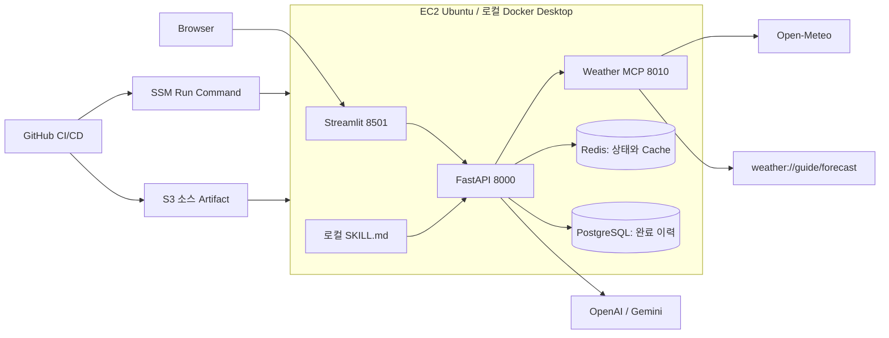

# 07 로컬에서 AWS까지: OpenAI·Gemini·MCP 통합 서비스

> **현재 Windows PC의 DB 계정·pgAdmin 정리:** [Windows DB 연결 가이드](WINDOWS_DATABASE_GUIDE.md).
> Windows PostgreSQL을 직접 쓰는 경로와 아래 Docker PostgreSQL 경로를 구분하세요.

00~06의 실행 환경과 배포 실습을 **하나의 Weather Agent 프로젝트**로 통합합니다.
이 폴더만으로 로컬 저장소 준비, Container 실행, GitHub CI/CD, EC2·VPC 구성,
OpenAI·Gemini 호출, MCP tools·resources·skill 연결, 상태 보존과 장애 복구를 진행합니다.
기존 00~06은 개별 주제를 복습할 때 사용할 수 있도록 보존했습니다.

사용자는 도시와 날짜를 선택합니다. Backend는 실제 날씨를 MCP에서 조회하고,
데이터 해석 resource와 로컬 SKILL.md를 함께 읽어 OpenAI·Gemini에 전달합니다.
화면에는 답변·원자료·Cache 여부가 나오고 완료 이력은 PostgreSQL에 남습니다.

## 1. 기존 내용이 어디에 합쳐졌나요?

| 기존 단원 | 07에서 배우는 내용 |
| --- | --- |
| 00 local services | PostgreSQL·Redis·Volume·Network를 Infrastructure Compose로 실행 |
| 01 multi LLM compose | Frontend→Backend→LLM 흐름, OpenAI·Gemini 대체 provider |
| 02 GitHub CI | 테스트·Compose 검사·Image Build를 PR마다 반복 |
| 03 AWS EC2 | 가상화, VPC·Subnet·Route·Security Group, EC2 최초 준비 |
| 04 GitHub CD | main CI 이후 OIDC→S3→SSM→EC2 배포 |
| 05 Weather MCP | Open-Meteo를 호출하는 실제 MCP tool 서버 |
| 06 stateful deployment | Redis Cache·진행 상태, PostgreSQL 이력, 앱만 재배포 |
| 새로 추가 | OpenAI·Gemini 호출, MCP resource 읽기, SKILL.md의 명시적 로딩 |

Ollama는 00의 선택형 로컬 모델 예시입니다. 이 통합 프로젝트에서는 OpenAI를 기본으로, Gemini를 선택형으로
사용하므로 Ollama Container와 모델 다운로드는 필요하지 않습니다.

## 2. CI/CD 개념부터 이해하기

Git은 코드 변경 이력, GitHub는 원격 저장소와 협업 공간입니다. Commit은 변경 묶음이고
Push는 원격 전송, Pull Request(PR)는 변경을 검토하고 합치기 위한 요청입니다.

**CI(Continuous Integration)**는 변경이 합쳐져도 되는지 자동 검사합니다.
**Continuous Delivery**는 검증한 변경을 배포 가능한 상태로 준비하고 사람이 최종 승인합니다.
**Continuous Deployment**는 정해진 검사를 통과하면 운영 반영까지 자동화합니다.
이 예제는 production Environment에 reviewer를 설정하면 승인형 Delivery가 됩니다.
reviewer를 설정하지 않으면 main Push 후 자동 배포됩니다.

```text
개발 PC: 수정 → 로컬 테스트 → commit → push → PR
GitHub CI: checkout → Python → 테스트 → Compose 검사 → Image Build → 소스 Artifact
main CI 성공 → production 승인(설정 시)
GitHub CD: OIDC 임시 AWS 권한 → Artifact를 S3에 업로드 → SSM SendCommand
EC2: 같은 commit 소스 다운로드 → 이미지 재빌드 → 앱 교체 → Readiness 확인
```

Runner는 작업을 실행하는 별도 머신, Job은 작업 묶음, Step은 Job 내부 순서입니다.
`needs: ci`는 CI 성공 후 배포한다는 뜻입니다. PR에서는 운영 권한을 받지 않습니다.
CI Runner에 내 PC의 `.env`, Redis, DB, Docker Volume은 없습니다.
테스트는 외부 LLM과 저장소를 Fake로 바꾸고, 실제 연결은 로컬·EC2에서 별도로 확인합니다.

현재 CD는 CI에서 검증한 **소스**를 배포하고 EC2에서 이미지를 다시 만듭니다.
CI의 이미지와 EC2 이미지가 같은 digest라고 보장하지 않습니다. 의존성 범위도 열려 있습니다.
운영 확장 시에는 lock 파일을 관리하고 CI에서 만든 이미지를 ECR에 push한 뒤 digest로
배포하세요. 무중단 배포와 자동 rollback은 이 실습 범위에 포함하지 않습니다.

## 3. 가상화·EC2·VPC를 구분하기

| 개념 | 의미 | 이 실습에서의 위치 |
| --- | --- | --- |
| 물리 서버 | 실제 CPU·메모리·디스크 | AWS가 관리하는 하드웨어 |
| VM | 가상 하드웨어와 자기 OS를 가진 실행 환경 | EC2 Ubuntu 인스턴스 |
| Container | 호스트 커널을 공유하며 프로세스·파일 시스템 등을 격리 | Backend·MCP·DB 등 |
| Image | Container를 만드는 파일·실행 설정 묶음 | Dockerfile로 build |
| Python venv | 프로젝트별 Python 패키지 격리 | 로컬 pytest 환경 |
| VPC | AWS의 논리적으로 격리된 네트워크 | EC2가 들어갈 IP 공간 |
| Subnet | VPC 주소 범위의 일부, 하나의 AZ에 속함 | EC2가 배치되는 구역 |
| Route table | 목적지 IP별 다음 경로 | 인터넷 방향은 Internet Gateway |
| Security Group | 네트워크 인터페이스의 상태 기반 허용 규칙 | EC2 접근 제한 |
| IAM role | AWS API를 호출할 수 있는 권한 | SSM·S3 접근 |
| Docker network | Container 사이의 통신·서비스 이름 해석 | `weather-07` |
| Volume | Container 수명과 별개인 저장 공간 | PostgreSQL·Redis 데이터 |

VPC 자체는 서버도 VM도 아닙니다. Security Group은 AWS API 사용 권한을 주지 않으며
IAM role은 HTTP 연결 경로를 만들지 않습니다. 네트워크와 권한이 모두 맞아야 호출됩니다.
Windows Docker Desktop의 Linux Container는 WSL2 등 Linux 실행 환경의 커널을 사용합니다.
EC2에서는 Ubuntu 커널 위에서 Docker가 실행됩니다.

## 4. 완성 구조와 요청 순서



1. Frontend가 `POST /api/weather`로 도시·날짜·provider를 보냅니다.
2. Backend가 run_id를 반환하고 Redis에 진행 상태를 기록합니다.
3. Cache miss이면 MCP `get_weather`를 호출해 Open-Meteo의 날씨를 받습니다.
4. MCP `read_resource("weather://guide/forecast")`로 단위·해석 안내를 읽습니다.
5. Backend가 `backend/skills/weather-briefing/SKILL.md`를 파일에서 읽습니다.
6. 날씨 JSON + resource + skill을 OpenAI·Gemini 호출에 전달합니다.
7. 답변과 원자료를 PostgreSQL에 저장하고 Redis 상태를 completed로 바꿉니다.
8. Frontend가 상태 API를 Polling하여 결과를 표시합니다.

이 예제는 Backend가 호출 순서를 결정하는 **명시적 workflow**입니다. LLM이 MCP 서버에
직접 접속하거나 tool을 자율 선택하는 구조가 아닙니다. LLM의 자율 tool-use 왕복 루프와 구분하세요.

## 5. Tools, Resources, Prompts, Skills

| 구분 | 역할 | 연결 예 |
| --- | --- | --- |
| MCP tool | 인수를 받아 실행하는 기능 | `get_weather(city, day)` |
| MCP resource | URI로 읽는 문맥·자료 | `weather://guide/forecast` |
| MCP prompt | 서버가 제공하는 재사용 프롬프트 템플릿 | 개념 비교용, 이 서버에는 등록하지 않음 |
| Skill | 절차·규칙을 담은 파일 묶음 | `weather-briefing/SKILL.md` |

**Skill은 MCP의 기본 프로토콜 항목이 아닙니다.** 파일을 놓기만 해서는 현재 앱에
연결되지 않습니다. 이 예제는 `generate_answer()`에서 파일을 읽고 요청 문맥에 넣습니다.
resource도 목록에 보인다고 모델이 자동으로 읽지 않습니다. Backend의 `read_resource()`와
문맥 조립이 실제 연결 지점입니다. tool description과 readOnlyHint는 권한 강제 장치가 아닙니다.

새 도구는 `mcp_server/server.py`에 `@mcp.tool()` 함수로 등록하고 Backend에서 명시적으로
호출하세요. 새 자료는 `@mcp.resource("weather://...")`로 등록한 뒤 URI를 읽습니다.
다른 서버를 붙일 때는 별도 서비스와 URL로 `ClientSession`을 만들고 초기화합니다.
이 예제에서 여는 서버는 Weather MCP 하나이며 tool과 resource를 같은 서버가 제공합니다.

코드 읽기 순서:

```text
mcp_server/server.py                 tool·resource 등록, HTTP 서버 시작
backend/app.py:mcp_session           MCP 연결과 initialize
backend/app.py:call_weather_tool     tools/call
backend/app.py:read_weather_guide     resources/read
backend/app.py:generate_answer       skill 로딩과 OpenAI·Gemini 호출
backend/app.py:execute_weather_agent 상태·Cache·저장 통합
```

## 6. 로컬 준비: 이 폴더에서만 실행

준비물은 Git, Python 3.12, Docker Desktop(Linux Containers), 선택 provider 자격 증명입니다.
Windows에서 Docker가 없다면 Docker Desktop 설치 후 WSL2를 준비하고 재시작하세요.
`docker version`에 Client와 Server가 모두 나와야 합니다.

```powershell
Set-Location 'C:\수업 보관소\aidevs-latest\aidevs-main\aidevs-main\07_multi-agent-service-ops\00_runtime-and-deployment\07_integrated-bedrock-mcp'
docker version
docker compose version
Copy-Item .env.example .env
```

이미 `.env`가 있으면 복사 단계를 건너뜁니다. DB 비밀번호는 영문·숫자 조합으로 변경하세요.
처음 만든 DB Volume의 비밀번호는 나중에 `.env`만 바꾼다고 변경되지 않습니다.
설정한 provider만 선택하면 됩니다. OpenAI·Gemini로 먼저 실행할 때는 해당 키를 넣습니다.
다음 절차로 선택한 provider의 API 키를 준비합니다.

### LLM API 키 설정

기본 provider는 OpenAI입니다. `.env`에 `OPENAI_API_KEY`를 입력하고 계정에서 사용할 수 있는
`OPENAI_MODEL`을 설정하세요. Gemini를 쓰려면 `GEMINI_API_KEY`와 `GEMINI_MODEL`을 설정하고
화면에서 `gemini`를 선택합니다. 두 키를 모두 입력할 필요는 없습니다.
AWS 로그인이나 모델 사용 승인은 로컬 LLM 실행에 필요하지 않습니다.
현재 API 키가 비어 있다면 MCP 조회와 DB 준비는 가능하지만 LLM 답변 생성은 실패합니다.

### Infrastructure → Application 실행

```powershell
docker compose -f compose.infrastructure.yml config --quiet
docker compose -f compose.infrastructure.yml up -d --wait
docker compose -f compose.application.yml up -d --build --wait
```

로컬과 EC2 모두 동일한 앱 Compose를 사용합니다. LLM 인증은 서버 `.env`의 API 키를 사용합니다.

| 주소 | 사용 위치 |
| --- | --- |
| `http://127.0.0.1:8501` | 사용자 Browser |
| `http://127.0.0.1:8000/docs` | 로컬 API 문서 |
| `http://weather-mcp:8010/mcp` | Backend Container의 MCP 주소 |
| `database:5432`, `redis:6379` | Docker 내부 전용 |

호스트의 `127.0.0.1`과 Container의 `127.0.0.1`은 다른 위치입니다. Container는 서비스
이름으로 서로 찾습니다. 프로젝트 이름·Network·Volume은 07 전용이며 기존 06 데이터를
가져오지 않습니다. 8000·8501은 같은 호스트에서 중복 사용될 수 있으므로 기존 앱이 사용
중이면 그 앱을 확인하고 중지한 뒤 07을 실행하세요.

### 정상 동작 확인

```powershell
Invoke-RestMethod http://127.0.0.1:8000/health/live
Invoke-RestMethod http://127.0.0.1:8000/health/ready
docker compose -f compose.application.yml logs --tail=50 backend weather-mcp
```

화면에서 서울·내일·openai을 선택합니다. 도시 검색 실패 시 `Seoul`로도 확인하세요.
답변에 표시된 날짜·기온·강수 확률을 tool 결과와 비교합니다. 같은 요청을 반복하면
Cache가 사용되지만 LLM은 다시 호출되므로 추론 비용은 발생합니다.
Readiness는 Redis·DB·Schema·MCP tool·resource·skill을 검사합니다.
**선택 provider의 키·모델·외부 Open-Meteo 연결 성공은 실제 조회로 확인**해야 합니다.

## 7. 로컬 CI와 GitHub 연결

MCP 프로토콜만 따로 확인하려면 실행 중인 Backend Container에서 probe를 실행합니다.
이 명령은 실제 서버에 initialize → tools/list → resources/list → resources/read를 보내며,
`--city`를 추가하면 Open-Meteo tool도 호출합니다. OpenAI·Gemini 요청은 하지 않습니다.

```powershell
docker compose -f compose.application.yml exec backend python mcp_probe.py
docker compose -f compose.application.yml exec backend python mcp_probe.py --city Seoul
```

예상 목록은 `get_weather`, `weather://guide/forecast`입니다. `curl /health` 성공은 HTTP
프로세스 확인이며 이 MCP 연결 검사와는 다릅니다.

```powershell
python -m venv .venv
.\.venv\Scripts\python.exe -m pip install -r backend/requirements.txt pytest
.\.venv\Scripts\python.exe -m pytest backend -q
docker compose -f compose.infrastructure.yml config --quiet
docker compose -f compose.application.yml config --quiet
docker compose -f compose.application.yml build
```

이 폴더에는 workflow **템플릿** [deploy/github-actions.yml](deploy/github-actions.yml)이
있습니다. GitHub는 저장소 루트 `.github/workflows`만 실행하므로 복사해야 합니다.

```powershell
$repoRoot = git rev-parse --show-toplevel
New-Item -ItemType Directory -Force (Join-Path $repoRoot '.github/workflows') | Out-Null
Copy-Item deploy/github-actions.yml (Join-Path $repoRoot '.github/workflows/07-integrated-bedrock-mcp.yml')
git check-ignore .env
git status --short
```

`PROJECT_DIR`는 **Git 루트 기준 상대 경로**입니다. 현재 저장소 배치에 맞춰
`aidevs-main/aidevs-main/07_multi-agent-service-ops/00_runtime-and-deployment/07_integrated-bedrock-mcp`
로 작성되어 있습니다. 07 폴더 자체를 새 저장소로 만들면 `PROJECT_DIR: .`로 바꾸세요.
원격 저장소는 본인의 저장소를 사용하고 변경 파일을 확인한 후 commit·push·PR을 진행합니다.
`.env`, AWS 자격 증명, `.venv`는 포함하지 않습니다.

처음에는 PR에서 CI만 확인합니다. 이후 AWS 준비를 마치고 main에 병합하면 배포됩니다.
`workflow_dispatch deploy=false`는 CI만, main에서 `deploy=true`는 CI 후 CD입니다.
구형 05·06 workflow가 같은 EC2로 배포한다면 Actions에서 해당 workflow를 비활성화하고
기존 앱을 확인 후 중지하세요. 워크플로 이름의 번호와 학습 폴더 번호는 별개입니다.

## 8. EC2·VPC를 처음 만드는 순서

아래 실습은 EC2 한 대에 다섯 Container를 올립니다. 운영 고가용성 구성은 아닙니다.

1. EC2·S3 배포에 사용할 AWS Region을 정합니다.
2. VPC 콘솔에서 VPC `10.70.0.0/16`을 만들고 DNS resolution을 활성화합니다.
3. 같은 VPC에 한 AZ의 Subnet `10.70.1.0/24`를 만듭니다.
4. Internet Gateway를 만들고 VPC에 연결합니다.
5. Subnet에 연결된 Route table에 `0.0.0.0/0 → Internet Gateway`를 추가합니다.
6. EC2 Ubuntu 24.04 LTS x86_64를 이 Subnet에서 생성하고 Public IPv4를 할당합니다.
   교육용 시작 예시는 2 vCPU·4 GiB RAM·30 GiB gp3입니다. 실제 가격·용량은 계정에서 확인합니다.
7. 전용 Security Group의 SSH 22만 관리자 IP `/32`에 허용합니다. 앱·DB·MCP 포트는 열지 않습니다.
8. 다음 절의 EC2 IAM role을 Instance Profile로 연결합니다.
9. EC2 Metadata options는 IMDSv2 required로 설정합니다. Instance Profile은 호스트의 SSM·S3 배포에 사용하고 Backend는 AWS 자격 증명을 사용하지 않습니다.

Public Subnet이라는 이름만으로 인터넷이 연결되지 않습니다. **Public IP + IGW 연결 + Route +
SG/NACL 허용**을 함께 확인합니다. 이 실습의 outbound는 DNS와 HTTPS 외부 호출이 가능해야
합니다. Private Subnet으로 바꾸면 NAT 또는 필요한 VPC endpoint를 설계해야 하며,
Open-Meteo 같은 공용 API에는 별도 인터넷 egress가 필요합니다.

OpenAI·Gemini는 EC2 안에 설치하는 모델 서버가 아닙니다. Backend가 선택한 provider의 API를 호출합니다.
EC2 stop 시에도 EBS·일부 IP 등 비용이 남을 수 있으며 OpenAI·Gemini은 요청량에 따른 별도 비용입니다.

### EC2의 Docker·AWS CLI·SSM 준비

SSH 키를 안전하게 보관하고 관리자 PC에서 접속합니다.

```powershell
ssh -i C:\keys\weather-07.pem ubuntu@EC2_PUBLIC_IP
```

이후는 **EC2 Ubuntu의 Bash** 명령입니다.

```bash
sudo apt-get update
sudo apt-get install -y ca-certificates curl unzip
sudo install -m 0755 -d /etc/apt/keyrings
sudo curl -fsSL https://download.docker.com/linux/ubuntu/gpg -o /etc/apt/keyrings/docker.asc
sudo chmod a+r /etc/apt/keyrings/docker.asc
. /etc/os-release
echo "deb [arch=$(dpkg --print-architecture) signed-by=/etc/apt/keyrings/docker.asc] https://download.docker.com/linux/ubuntu $VERSION_CODENAME stable" | sudo tee /etc/apt/sources.list.d/docker.list > /dev/null
sudo apt-get update
sudo apt-get install -y docker-ce docker-ce-cli containerd.io docker-buildx-plugin docker-compose-plugin
sudo systemctl enable --now docker
curl -fsSL https://awscli.amazonaws.com/awscli-exe-linux-x86_64.zip -o /tmp/awscliv2.zip
unzip -q /tmp/awscliv2.zip -d /tmp/weather-07-awscli
sudo /tmp/weather-07-awscli/aws/install --update
sudo docker compose version
aws --version
sudo snap list amazon-ssm-agent
```

Ubuntu 이미지에 SSM Agent가 없다면 `sudo snap install amazon-ssm-agent --classic`으로
설치합니다. `sudo snap start amazon-ssm-agent` 후 Systems Manager의 Fleet Manager에서
해당 EC2가 Online인지 확인합니다. Offline이면 Instance Profile, Agent 상태, HTTPS egress와
DNS를 확인하세요. CD는 SSH 대신 SSM을 사용하므로 GitHub Runner IP를 SG에 추가하지 않습니다.

EC2에서 설정 파일을 최초 한 번 만듭니다.

```bash
sudo install -d -m 700 /opt/weather-07/shared
sudo nano /opt/weather-07/shared/.env
sudo chmod 600 /opt/weather-07/shared/.env
```

이 폴더의 `.env.example` 내용을 입력하고 DB 비밀번호·선택한 provider의 API 키와 모델를
실제 값으로 설정합니다. AWS access key를 입력하지 않습니다. CD는 이 파일을 읽기만 합니다.
Image나 GitHub Artifact에 이 파일을 넣지 않습니다.

## 9. AWS 권한과 GitHub production 설정

**EC2 역할**과 **GitHub 배포 역할**은 서로 다른 주체입니다. 정책 템플릿은
[deploy/iam-policies.md](deploy/iam-policies.md)에 있으며 실제 ARN으로 치환한 뒤 적용합니다.

| 주체 | 필요한 권한 | 필요 없는 권한 |
| --- | --- | --- |
| EC2 Instance Profile | SSM 관리, 지정 S3 prefix 읽기 | GitHub 저장소 쓰기 |
| GitHub OIDC 배포 role | 지정 S3 prefix 업로드, 대상 EC2 SendCommand, 결과 조회 | OpenAI·Gemini 호출 |

1. 전용 S3 bucket을 EC2와 같은 Region에 만듭니다. Public access block을 유지하고 기본
   SSE-S3 암호화를 사용합니다. 소스 archive 보존용 Lifecycle 만료 규칙을 설정합니다.
2. EC2 역할에 `AmazonSSMManagedInstanceCore`와 S3 읽기 정책을 연결합니다.
3. IAM OIDC provider `https://token.actions.githubusercontent.com`을 만들고 audience를
   `sts.amazonaws.com`으로 둡니다. 이미 있으면 재사용합니다.
4. 배포 역할의 trust policy에서 본인 `OWNER/REPO`의 `environment:production`만 허용합니다.
5. GitHub Settings → Environments → `production`을 만들고 Deployment branch를 main으로
   제한합니다. 계정에서 지원하면 Required reviewers를 설정합니다.
6. production의 **Variables**에 아래 값을 등록합니다. OIDC이므로 장기 AWS key Secret은 없습니다.

| Variable | 값 |
| --- | --- |
| `AWS_REGION` | EC2·S3가 있는 Region, 예: ap-northeast-2 |
| `AWS_DEPLOY_ROLE_ARN` | GitHub OIDC 배포 역할 ARN |
| `ARTIFACT_BUCKET` | 전용 S3 bucket 이름, s3:// 제외 |
| `EC2_INSTANCE_ID` | 대상 i-… ID |


## 10. 첫 CD 실행과 EC2 화면 확인

1. PR에서 CI 초록색을 확인합니다.
2. main 병합 또는 Actions → 07 Integrated Weather MCP → Run workflow(main, deploy=true).
3. 설정한 경우 production 배포 승인을 진행합니다.
4. CD의 출력에서 SSM command ID를 확인합니다. SSM 최종 Success 이후에만 Job이 성공합니다.
5. 서버에서 `sudo docker ps`와 아래 Readiness를 확인합니다.

```bash
curl --fail http://127.0.0.1:8000/health/ready
cd /opt/weather-07/current
sudo docker compose -f compose.application.yml ps
```

포트는 서버 loopback에 바인딩되어 있으므로 관리자 PC에서 SSH 터널을 엽니다.
로컬 실습의 8501과 충돌하지 않도록 PC 포트는 18501을 사용합니다.

```powershell
ssh -i C:\keys\weather-07.pem -N -L 18501:127.0.0.1:8501 ubuntu@EC2_PUBLIC_IP
```

터널을 유지한 채 Browser에서 `http://127.0.0.1:18501`을 열고 실제 OpenAI·Gemini 조회를 합니다.
이것으로 MCP→Open-Meteo→resource→skill→OpenAI·Gemini→PostgreSQL 전체 경로를 확인합니다.
일반 사용자 공개 서비스로 확장할 때는 TLS·인증을 갖춘 reverse proxy/ALB를 설계하세요.

## 11. 상태 유지·재배포·실패 실습

### 상태 보존

```bash
cd /opt/weather-07/current
sudo docker compose -f compose.infrastructure.yml exec database psql -U agent_user -d agent_db -c 'SELECT run_id, city, requested_day, provider, model, created_at FROM weather_agent.runs ORDER BY created_at DESC LIMIT 5;'
sudo docker compose -f compose.infrastructure.yml exec redis redis-cli --scan --pattern 'weather:*'
```

SQL 명령의 DB·사용자 이름은 `.env`에서 바꿨다면 맞춰주세요. skill 문장을 변경해 다시
배포한 뒤 기존 이력이 남아 있는지 확인합니다. 앱·인프라 Compose project name과 Volume이
고정되어 있으므로 release 디렉터리가 달라도 같은 DB를 사용합니다.
Infrastructure `up`은 매번 확인하지만 설정이 같으면 기존 Container를 유지합니다.
인프라 설정을 변경하면 재생성될 수 있으므로 운영에서는 별도 배포·migration 절차를 둡니다.

### 실패 지점 찾기

| 증상 | 확인·복구 |
| --- | --- |
| docker 명령/Server 없음 | Docker Desktop·PATH·Linux Engine 확인 |
| weather-07 Network 없음 | Infrastructure부터 실행 |
| DB 인증 실패 | 최초 Volume 비밀번호와 `.env` 비교, 임의 Volume 삭제 금지 |
| MCP 421 / Invalid Host | URL과 `allowed_hosts` 일치 여부 확인 |
| resource 실패 | URI·등록 함수·MCP 새 Image 확인 |
| skill 없음 | Dockerfile의 COPY skills와 파일 경로 확인 |
| CI는 성공, CD 실패 | production Variables·OIDC trust·SSM Online·S3 권한 확인 |
| SSM 배포 성공, LLM 실패 | Readiness는 실제 유료 모델 호출을 검사하지 않음; 화면 조회 필요 |
| 진행 상태가 멈춤 | 배포 시 프로세스 종료 여부 확인; 새 요청으로 재시도 |

장애 실습: `weather-mcp` Container를 stop하고 Readiness 실패를 확인한 후 start합니다.
DB를 삭제하지 않고 앱만 재배포해 이력이 남는지도 확인합니다. Redis Cache TTL은 기본
600초, 진행 상태는 1시간입니다. Cache 키는 한국 날짜를 포함하지만 도시별 자정 경계까지
엄밀하게 맞추는 운영용 Cache는 아닙니다.

### 복구와 한계

FastAPI BackgroundTasks는 **내구성 있는 Queue가 아닙니다**. 앱 재시작 중인 작업은
유실될 수 있으며 실패 작업은 PostgreSQL에 저장되지 않습니다. 저장 성공 후 Redis 기록
실패 시 화면 상태와 DB 이력이 다를 수 있습니다. 실습은 단일 Backend 기준입니다.
운영 확장에는 외부 Queue/Worker, 작업 재조정과 DB migration을 추가하세요.

실패 배포는 자동 rollback하지 않습니다. 마지막 정상 소스로 되돌리는 revert commit을
만들고 CI/CD를 다시 실행하는 것이 기본 복구입니다. 응급 복구는 SSM/관리자 세션에서
이전 성공 release의 `deploy/deploy.sh`를 실행합니다. DB schema가 호환되는지 먼저 확인합니다.
`current` 링크는 Readiness 성공 시에만 바뀌지만 실패한 새 Container가 남을 수 있습니다.

## 12. 종료와 완료 기준

로컬에서 앱을 내리고 이어서 인프라를 내립니다. 일반 down은 Volume을 보존합니다.

```powershell
docker compose -f compose.application.yml down
docker compose -f compose.infrastructure.yml down
```

`down -v`는 DB 이력을 삭제하므로 데이터 초기화가 필요한 경우에만 별도로 판단합니다.
AWS 실습 종료 시 workflow를 비활성화한 뒤 본인 소유 EC2·EBS·Public/Elastic IP·S3 보존
데이터를 확인해 정리하세요. 전용 VPC는 연결 자원 정리 후 삭제합니다. 공유 IAM/OIDC/VPC는
다른 프로젝트가 사용할 수 있으므로 삭제 대상으로 취급하지 않습니다.

- [ ] CI와 CD, VM과 Container, VPC와 IAM의 차이를 설명한다.
- [ ] 로컬에서 실제 tool 결과와 OpenAI·Gemini 답변을 확인한다.
- [ ] resource와 skill이 요청 문맥에 들어가는 코드 위치를 찾는다.
- [ ] PR CI 성공과 main CD의 SSM 완료를 각각 확인한다.
- [ ] EC2에서 실제 조회 후 PostgreSQL 이력을 확인한다.
- [ ] 앱 재배포 후 이력이 유지되고 MCP 장애 시 Readiness가 실패한다.
- [ ] 진행 중 작업의 재시작 한계와 비용 정리 대상을 설명한다.

## 공식 문서와 예제 범위

- [MCP Python SDK v1.x](https://github.com/modelcontextprotocol/python-sdk/tree/v1.x): 이 예제는 `mcp>=1.27,<2` API를 사용합니다.
- [EC2 IMDS](https://docs.aws.amazon.com/AWSEC2/latest/UserGuide/configuring-instance-metadata-service.html): EC2의 metadata 인증 설정.
- [GitHub OIDC와 AWS](https://docs.github.com/en/actions/how-tos/secure-your-work/security-harden-deployments/oidc-in-aws): 임시 자격 증명과 trust 조건.
- [Docker Ubuntu 설치](https://docs.docker.com/engine/install/ubuntu/)
- [SSM 관리형 노드 준비](https://docs.aws.amazon.com/systems-manager/latest/userguide/managed_instances.html)

이 폴더는 실행 가능한 교육 예제와 배포 템플릿입니다. 실제 계정 생성·권한 연결·GitHub
workflow 활성화·유료 OpenAI·Gemini 호출은 위 실습 순서에 따라 사용자 환경에서 수행합니다.
